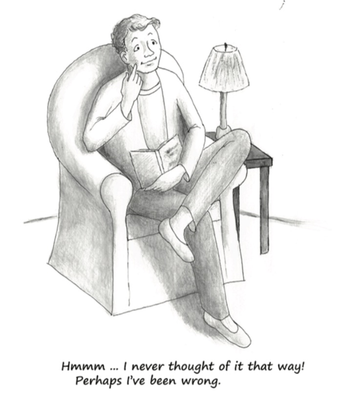

# 12. 第十章：观念有其结果

The Essential Hayek 翻译

## 第十章 Ideas have consequences 观念有其结果

 The state of opinion which governs a decision on political issues is always the result of a slow evolution, extending over long periods and proceeding at many different levels. New ideas start among a few and gradually spread until they become the possession of a majority who know little of their origin.

Friedrich Hayek \(1960\). The Constitution of Liberty. In Ronald Hamowy \(ed.\), The Constitution of Liberty, XVII \(Liberty Fund Library, 2011\): 177.

支配政治决策的观点总是缓慢进化的结果，这种进化历时很久，并且是在多重不同的水平进行的。新思想最初产生于少数人中，而后逐步传播，直至被对其起源所知甚少的大众所接受。（《自由宪章》，第七章，哈耶克）

\*\*\*

Karl Marx insisted that the ideas that you, I, and other people hold are shaped and powered by our station and function in the economy. Ideas themselves play no independent role in shaping the contours or in governing the destiny of an economy and society.

卡尔·马克思坚持说人的观念是由他在经济中的地位和功能决定的。观念本身并不能独立地塑造或控制经济和社会。

The great twentieth-century economist George Stigler \(1911-1991\) also believed that ideas have no consequences. In Stigler’s view, every individual always seeks to maximize his or her own material well-being. Government officials, therefore, serve only those individuals and groups that best promote the well-being of government officials. According to Stigler, legislation and public policies are never the result of ideas or ideals. Instead, legislation and public policies are the result only of the interplay of narrow material interests — particularly the interests of groups that succeed in organizing themselves into effective political lobbies.

20世纪杰出的经济学家乔治·斯蒂格勒\(1911-1991\)也相信观念不重要。在斯蒂格勒看来，人们总是寻求最大化物质上的享受。因此政府官员只为那些能给自己带来最多好处的个人和团体服务。按斯蒂格勒的说法，立法和公共政策从来就不是观念和理想的产物，而是狭隘的物质利益——特别是那些能进行有效政治游说的团体的利益相互作用的结果。

Marx, of course, was a man of the political left. Stigler was a man of the political right. Yet according to both Marx and Stigler, ideas are determined; ideas do not determine. Marx and Stigler each was driven by the idea that nothing as intangible, as subjective, as unobservable, and as unquantifiable as mere ideas could play a significant role in driving a society.

马克思毫无疑问属于政治上的左派。斯蒂格勒则是右派。但他们都认为观念是被决定的，而非做决定的。他们都认为像纯观念这样无形、主观、难以观察和量化的东西在社会演化中是起不了多大作用的。

Marx and Stigler are not alone. Many are the scholars — especially in economics — who dismiss any suggestion that ideas independently affect public policy. In these scholars’ view, the only forces that determine the performance of economies and the details of public policies are calculations of material personal profit and loss.

马克思和斯蒂格勒并不孤单。很多学者，尤其是经济学家都对观念能独立影响公共政策的可能性不予考虑。在这些学者看来，决定经济表现和公共政策细节的唯一力量是对个人物质得失的计算。

There are important kernels of truth buried within the idea that ideas are insignificant in the formation of public policies. Society cannot be formed into whatever ideas we might dream up, yet too many people throughout time have rejected this reality in favour of their utopian dreams. History has no shortage of schemes to rid societies of self-interest and material concerns, leaving the likes of love, universal brotherhood, or the assumed benevolence of powerful leaders to govern our affairs. All of these plans and schemes have failed. So to avoid being dazzled by the false promise of romantic and utopian schemes, we must never lose sight of the unavoidability of resource scarcities and of the reality of human nature — including the impossibility for each of us to know and care deeply about the millions of strangers who are part of our society.

认为观念对公共政策的形成没有显著影响的看法确实包含了重要的真相。社会不可能被任意塑造成我们梦想的样子。历史上有太多人拒绝承认这一点，而去追求乌托邦的梦想。他们在历史上留下了许多方案，想让社会摆脱自利和物质利益，让爱、普遍的同志情谊或者被假定为慈爱的强力领导者来管理社会事务。这些方案和计划都失败了。所以为了避免被这些浪漫和乌托邦计划的虚假承诺搞糊涂，我们必须永远记住无法回避的资源稀缺性和人性的现实——比如我们不可能深入了解和关心社会中成千上万的陌生人。

This level-headed acceptance of reality, however, does not require that we reject the understanding that ideas have real consequences. Human beings are social animals, and ones with a remarkably sophisticated capacity for communication. We choose to live in groups and we are constantly talking and writing. And what are talking and writing if not a sharing of ideas? All this groupishness and incessant sharing of ideas means that we are influenced not only by what people do and by the details of our physical surroundings, but also by what people think — that is, by ideas.

但对现实的这种冷静接纳并不要求我们认为观念不会产生真实的后果。人类是具有非常复杂的交流能力的社会动物。我们选择生活于群体之中，并且不断地谈话、写作。谈话和写作如果不是在分享观念，那又是什么呢？这种群体性和持续不断的观念分享意味我们不仅被人们的行为和周围物理环境的细节所影响，还被人们是怎么想的——观念所影响。

No stronger evidence of the power of ideas exists than the fact that totalitarian governments, without exception, go to extreme lengths to control the ideas that people encounter. If ideas have no consequences, dictators and tyrants would spend no energy and treasure on preventing people from publishing whatever they please and saying whatever they wish. Nor would governments waste money on spreading propaganda. Freedom of expression would be universal if ideas had no power to determine what governments do and are prevented from doing.

观念有力量的最有力的证据体现在极权国家身上，它们无一例外都耗费巨大的努力来控制人们接触的观念。如果观念不重要，独裁者和暴君才不会花那么多精力和财富来阻止人们自由地出版和谈话。政府也不会浪费那么多钱进行宣传鼓动。如果观念无力决定政府该做什么也无力阻止政府的行为的话，表达的自由就应该变得很普遍。

Democratic governments with constitutionally limited powers also act as if ideas have consequences. Every piece of legislation, without exception, is trumpeted as promoting the public interest. Even statutes and regulations clearly aimed at helping only special-interest groups are packaged and presented to the public as vital measures for improving the condition of the overall society.

权力受宪法约束的民主政府也表现的像观念有其结果一样。每一条立法都毫无例外地被宣传为促进了公共利益，即使那些显然只是为了帮助特殊利益群体的法律规章也会被包装成提高社会整体环境的重要方法并呈现给公众。

Consider, for example, farm subsidies that are driven by the disproportionate political power of agricultural lobbies. No politician ever says, “I voted for these subsidies because farmers are politically powerful and the consumers and taxpayers who foot the bill are not.” If George Stigler were correct that government policies are driven only by special-interest groups — and therefore that the ideas that people have about the “rightness” or “wrongness” of policies are irrelevant — then governments wouldn’t bother to portray farm subsidies and the creation of other special-interest-group privileges as being in the public interest. The very dishonesty and duplicity that is so common in the pronouncements of all governments, today and in the past, testify to the power of ideas.

例如考虑下农业补贴，它是由农业游说团体拥有的不成比例的政治力量驱动的。没有哪个政客会说，“我投票支持这些补贴是因为农民在政治上很有力量而为此买单的消费者和纳税人没有。”如果斯蒂格勒是对的，政府政策只是由特殊利益团体推动的，因此人们关于政策“对错”的观念与此无关，那政府就不会费劲把农业补贴和其他为特殊利益团体创造的特权包装成为了公众利益。不论过去现在，政府声明中都普遍存在着不诚实和表里不一，这证明了观念的力量。

There can be no doubt that ideas have consequences.

无需怀疑，观念确有其结果。

Ideas about the appropriate role of government determine what government will attempt to do as well as what it must refrain from doing. And ideas about the appropriate role of government are in turn shaped by ideas about the way free markets work and about the justice or injustice of market processes and outcomes. No society, for example, will follow a policy of free trade if a dominant idea in that society is that trade with foreigners is evil or economically harmful. In contrast, no society will tolerate high tariffs and other protectionist measures if a dominant idea in that society is that restrictions on trade are ethically unacceptable and that free international trade is always economically beneficial.

关于政府的恰当角色的观念决定着政府会试着做些什么、克制着不做什么。而这些观念又是由关于自由市场如何运行、市场程序和结果的正义/非正义性的观念塑造的。举个例子，如果一个社会的主流观念是国际贸易是邪恶的或者对经济有害的，那它就永远不会追求自由贸易的政策。反之，如果主流观念认为限制贸易在道德上不可接受、自由的国际贸易总是在经济上有利，那社会就不会容忍高关税和其他保护主义措施。

Getting ideas “right” — and spreading those right ideas as widely as possible — is therefore of the highest importance. Widely held mistaken ideas about markets and government will inevitably produce economically damaging policies, while correct ideas about markets and government will foster economically beneficial policies.

因此获得“正确”的观念并尽力传播它是很重要的。对市场和政府的普遍错误认识会不可避免地导致损害经济的政策，而正确的认识会带来有益经济的政策。

But how are ideas produced, spread, and nurtured? How are today’s dominant ideas altered or replaced with other ideas? Families, churches, clubs, popular media, and \(of course\) schools all play a role. So, too, do public intellectuals — that is, newspaper and magazine columnists, bloggers, television and radio pundits, and book authors. Public intellectuals speak not only, or not even mainly, to other intellectuals; they speak chiefly to the general public. Being skilled specialists in communicating serious ideas to broad audiences, public intellectuals are the central participants in the process of distilling academic ideas into the language and forms that make those ideas accessible to the general public. Public intellectuals, as such, do not do original research or create new ideas. Instead, they report research findings and transmit academic ideas to people outside of the universities and think tanks.

但观念是如何产生、传播和培养的呢？今天的主流观念是如何改变或替代其他观念的呢？家庭、教会、俱乐部、大众媒体和（当然）学校，都在这过程中扮演着各自的角色。同样，还有公共知识分子——报纸杂志上的专栏作家、博主、电视电台的时事评论员、书籍写作者。公共知识分子的言论不仅仅、甚至主要不是说给其他知识分子听的。他们主要是说给大众听的。公共知识分子有着向广大听众解释严肃观念的特殊技巧，因此在把学术观念提炼成公众能理解的语言和形式的过程中，他们扮演着核心角色。这样的公共知识分子不做原创研究，也不创造新观念。他们只是汇报研究发现并把学术观念传播给大学和智库之外的大众。

Widely held ideas, then, about the operation of markets and about the promise or perils of government intervention have two main “producers”: the scholars, researchers, and academics who generate these ideas, and the public intellectuals who transmit these ideas to wide audiences. If the general public in modern society is to hold improved ideas about markets and politics, both academics and public intellectuals must contribute to this betterment.

因此大多数人关于市场如何运作与政府干预的希望和危险的观念来源于两个主要“生产者”：一是生产了这些观念的学者、研究人员和高校教师，一是把这些观念传播给大众的公共知识分子。如果想提高现代社会的公众对市场和政治的认识，学者和公共知识分子都必须做出贡献。

With the possible exception of history, no intellectual discipline plays as large a role in affecting the public’s ideas about markets and politics than does economics. John Maynard Keynes astutely observed in 1936 that “\[t\]he ideas of economists and political philosophers, both when they are right and when they are wrong are more powerful than is commonly understood. Indeed, the world is ruled by little else. Practical men, who believe themselves to be quite exempt from any intellectual influences, are usually slaves of some defunct economist.”

可能历史上偶有例外，但没有哪个学科在影响公众对市场和政治的观念上像经济学这么重要。约翰·梅纳德·凯恩斯在1936年敏锐地注意到“经济学家和政治哲学家的思想，无论对与错，都比我们所想象的更有力量。事实上，这个世界基本上都被它们控制。从事实际工作的人们认为他们并不受这些思想的束缚，但他们却往往是某些已经逝去经济学家的奴隶。”

Original research and theorizing today, of course, affects almost nothing today. The ideas of professional economists must first be distilled and spread by public intellectuals, and this process takes time. A prime example is Adam Smith’s scholarly case for free trade. When Smith first published his case for free trade in his monumental 1776 book, _An Inquiry into the Nature and Causes of the Wealth of Nations_, protectionist policies were well entrenched in Great Britain. These policies were so well entrenched that Smith thought it ludicrous to suppose that they would ever be discarded in favour of a policy of unilateral free trade. Yet on this matter Smith was wrong. Britain adopted a policy of free trade 70 years after Smith’s ideas were first published.

今天的新研究和理论当然对当下现实几乎没有影响。专业经济学家的观念得先由公共知识分子加以提炼和传播，而这个过程需要时间。一个很好的例子就是亚当·斯密的学术观点对自由贸易的影响。当斯密于1776年第一次发表他那本关于自由贸易的伟大著作——《国民财富的性质和原因的研究》（即《国富论》）时，保护主义政策正盛行于大不列颠。这些政策是如此根深蒂固以至于斯密认为对废除贸易保护改为单方面的自由贸易政策抱有期待是荒唐可笑的。不过这事斯密错了。70年后，不列颠采纳了自由贸易的政策。

Britain’s adoption of free trade \(which began in earnest with Parliament’s repeal of the “corn laws” — tariffs on grains — in 1846\) owes much to Smith’s own scholarly case for free trade. The logic and eloquence of Smith’s argument inspired other scholars to do further research into trade. This research largely confirmed and strengthened Smith’s conclusions. Just as importantly, it also inspired orators, pamphleteers, and other public intellectuals of the era to take up the cause of free trade. These public intellectuals explained to the public the benefits of free trade and the dangers of protectionism. By the mid-nineteenth century, public opinion in Britain had swung to free trade, along with other related free-market ideas. Not until the early twentieth century would Britain abandon free trade — an abandonment that itself was the product of intellectual developments some years earlier and that had been conveyed to wide audiences by public intellectuals.

不列颠对自由贸易的接纳（始于1846年议会热切地废除了向谷物征收关税的《谷物法》）很大程度上要归功于斯密对自由贸易的学术研究。斯密在论证中所展现的逻辑和雄辩鼓舞了其他学者去对贸易做更深入的研究。这些研究极大地确证并强化了斯密的结论。同样重要的，它也鼓舞着那个时代的演说家、宣传册写作者和其他公共知识分子开始关注自由贸易问题。这些公共知识分子向公众解释自由贸易的好处和保护主义的危害。到了19世纪中期，不列颠的民意已经转向支持自由贸易和其它相关的自由市场观念。之后直到20世纪早期不列颠才再次放弃自由贸易，而这依然是学术上早些年的进展经由公共知识分子传播给大众的产物。 

Britain’s experience with free trade and protectionism shows that if scholars get the ideas right, there’s a very good chance that those right ideas will eventually influence public policies for the better. But the flipside is also true: if scholars get the ideas wrong, then public policy will eventually reflect those wrong ideas.

不列颠关于自由贸易和保护主义的经历说明如果学者的观念对了，那正确的观念最终很可能会使公共政策变好。但反之亦然，如果学者持有错误的观念，公共政策最终会反映出这些错误。

No economist in the twentieth century has done as much to get the ideas right as did F.A. Hayek. From his pioneering research into booms and busts, through his explorations into the role of prices and the essence of market competition, to his profound analyses of the rule of law and of the importance of principles both for guiding human actions and for constraining even the best-intentioned government policies, Hayek breathed much-needed new vigour into the case for a society of free and responsible individuals. Hayek’s ideas not only continue to inspire original research by economists and other social scientists, but have become part of the discourse of many public intellectuals.

20世纪没有哪个经济学家像F.A.哈耶克那样努力去获取正确的观念。他对经济周期进行了开创性研究，又探索了价格的作用和市场竞争的本质，然后深刻分析了法治和对人类行为、限制（哪怕怀着最大善意的）政府政策起指导性作用的原则的重要性。哈耶克就这样给关于自由社会和负责任个体的研究注入了急需的新活力。哈耶克的思想不仅继续激发着经济学家和其他社会科学家的原创研究，还成为了许多公共知识分子的谈论主题。

Hayek’s ideas have already paid dividends. Margaret Thatcher, as Prime Minister of Great Britain, singled out Hayek for influencing her ideas about moving Britain away from collectivism. In the United States, Hayek’s work was a key source of inspiration and guidance for the greater reliance in that country, during the last quarter of the twentieth century, on free markets.

哈耶克的思想已经带来了回报。英国前首相撒切尔夫人在谈论谁影响了她要把英国从集体主义中拖出来的想法时，就单独提到了哈耶克。在20世纪的最后25年里，哈耶克的工作在美国也关键性地启发和指导着人们更普遍地依赖自由市场。

As Hayek himself understood, however, the case for freedom and free markets must continually be rejuvenated and made again and again and again. The project is never completed, as more recent political developments in Britain and the United States attest. Opposing ideas — those of collectivism of one form or another — are always being generated, refined, and spread. Failure by classical liberals and other defenders of a society based on free markets and strictly limited government to counter these collectivist ideas will guarantee the victory of collectivism.

但按哈耶克自己的理解，自由和自由市场的观念必须不断被赋予新生并一再重新发现。就像英美新近的政治动向显示的，这个任务永远不会最终完成。各种各样关于集体主义的相反观念总是在不断地产生、改进、传播。古典自由主义者和其他捍卫自由市场与严格限制政府权力的人如果不能成功的反驳这些集体主义观念，我们就会迎来集体主义的的胜利。

Being among the deepest and most profound ideas ever developed in the social sciences, Hayek’s ideas can continually nourish the intellectual and moral case for freedom for many generations to come. It is my hope that this little book will play some modest role in introducing people to Hayek’s ideas and in rousing them to build upon those ideas in order to help strengthen the sinews of a free civilization so that civilization will not only endure, but grow to encompass the globe.

作为社会科学中最深刻的思想之一，哈耶克的思想会继续在自由的智力和道德问题上滋养未来的许多世代。我希望这本小书在向人们介绍哈耶克的思想并唤醒他们根据这些思想去增强自由文明的根基上能起一些作用。这样自由文明不仅能持续，还能传遍全球。

