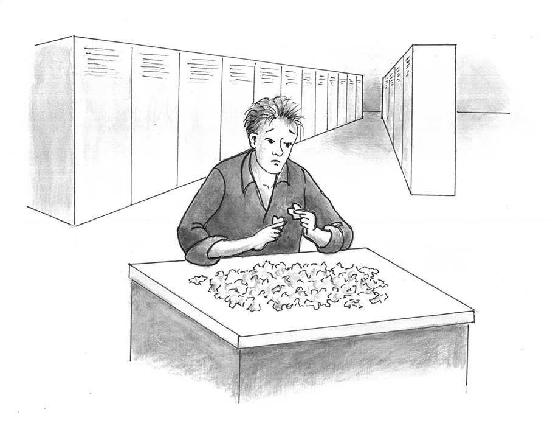
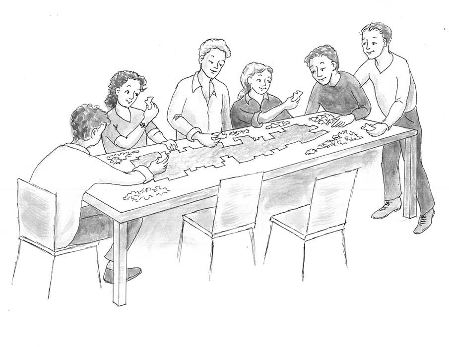

# 5. 第二章：知识和价格

The Essential Hayek 翻译

## 第二章 Knowledge and Prices 知识和价格

 We must look at the price system as such a mechanism for communicating information if we want to understand its real function ... The most significant fact about this system is the economy with which it operates, or how little the individual participants need to know in order to be able to take the right action.

Friedrich Hayek \(1945\). The Use of Knowledge in Society. In Bruce Caldwell \(ed.\), The Market and Other Orders, XV \(Liberty Fund Library, 2014\): 100.

如果我们想理解价格体系真正的功能，那我们必须把它视为一个信息交换机制……价格体系的最重要的特点是，其运转所需的知识很经济，就是说，参与这个体系的个人只需要掌握很少信息便能采取正确的行动。（《知识在社会中的运用》，哈耶克，1945）

\*\*\*

Imagine a jigsaw puzzle of one billion pieces. These pieces are scattered randomly across a pasture that is one million miles square. If someone assigns to you the task of finding all these pieces, how would you do so?

想象一副有十亿碎片的拼图，这些碎片随机地散落在一百万平方英里的牧场上，假如你被要求找出所有的碎片，你该怎么做？

One option is to search for each of these billion pieces by yourself. If you choose this option, you’ll likely die before you complete the task. Even if you live for 95 years and begin searching nonstop for the pieces the moment you are born, you’d have to find one piece every three seconds to find them all before you die.

一种做法是你一个人去找出所有碎片，那样你大概有生之年都做不完。即使你活到95岁并且从一出生就开始做这件事，你也得每3秒钟就找到一片拼图。

But suppose you enlist the help of 1,000 friends to fan out with you across the pasture, searching for the pieces. The task is now much easier. If each of you finds just one piece every 30 seconds, you and your friends together will complete the task in a little less than one year.

但如果你找来一千位朋友帮忙，那事情就轻松不少。如果每人每30秒就能找到一块拼图的话，你们不用一年就能完成任务。 

Of course, this task can be made even easier by enlisting the help of one million people or, better still, 100 million people. With 100 million people scouring the pasture for puzzle pieces, each person would have to find an average of only ten pieces. And so, if each of these 100 million searchers finds a piece every 30 seconds, the task will be completed in a mere five minutes.

当然，如果你能拉来一百万个朋友，或者一亿个，那就更简单了。一亿人的情况下平均每人只要找到十片拼图，所以如果每人每30秒能找到一片的话，那五分钟就完事了。

Human cooperation is powerfully productive. Still, in this example, simply collecting all the pieces of the jigsaw puzzle is not by itself a very valuable achievement. The puzzle must eventually be put together properly to justify the time and effort spent on finding all the scattered pieces.

人类合作就是有着这么强大的生产力。在这个例子里，仅仅找出所有拼图碎片并不是什么有意义的事，它们还得被正确地拼在一块才行。

Think of each jigsaw puzzle piece as a unit of information that is potentially useful for making the economy work successfully. One piece might be the information that deposits of bauxite exist in a certain location in Australia.

现在请将每一片拼图想象为一小块可能有助于经济顺利运行的信息。例如一片信息可能是“澳洲某某处有铝土矿”。 

Another piece might be the information about which mining engineers are especially skilled at designing an operation for extracting bauxite from the ground. A third piece is information about how best to transport the bauxite to a processing factory. A fourth piece is information on how to make a crucial part for the engine of the truck or the locomotive that will transport the bauxite. A fifth piece is how to design the roads or rails on which that truck or locomotive will be driven.

另一片信息可能是关于哪些工程师特别擅长设计装备以开采铝土矿，第三片是关于把铝土矿运到工厂的最佳方式，第四片是怎么制造运输矿石的卡车或火车的发动机，第五片是怎么设计道路或铁轨供货车行驶。

Clearly, the number of pieces of information that must be found and used for bauxite to become, say, the aluminum sheeting that forms the casing of the printing press that produced the pages that you are now reading is staggeringly large. It is a number far larger than the mere one billion pieces of the jigsaw puzzle in my example.

显然，从铝土矿的开采到最终产品——例如打印出你现在正在阅读的文章的印刷机里的铝片，需要极大量的信息碎片，远多于拼图例子里的十亿片。

It’s foolish to expect any one person \(or small group of people\) to find all the pieces of information necessary for the production of aluminum sheeting \(and for the production of fuselages for airliners, the production of oven foil, the production of soda cans ... the list is long\).

期待一个人（或一小群人）去找出生产铝片的全部信息显然是愚蠢的（或者是怎么生产大型客机的机身、烤箱用的烤箔、可乐罐……等等等等等等）

Not only is the mere finding of all the many pieces of information too difficult to entrust to a small group of people; so, too, is the task of putting these pieces together in a way that yields useful final products.

这不仅仅是因为一小群人难以找到所有需要的信息，而且他们也难以把这些信息拼成一个有用的最终产品。

Let’s now amend the example to make the jigsaw puzzle an even better metaphor for economic reality. Suppose that, unlike with regular jigsaw puzzles, each piece of this puzzle can be made to fit snugly and smoothly with any other piece. In this case, merely assembling all of the one billion puzzle pieces so that they fit together neatly is easy. But note that it is possible to create an unfathomably large number of scenes with these pieces.

现在我们改进一下拼图的比喻，让它更贴近真实经济。假设与普通拼图不同，这副拼图里的任意两片都可以拼在一块。这样一来，把所有碎片拼起来变得很容易，但拼出来的图案的可能性则成了天文数字。

Trouble is, only a tiny handful of these scenes will please the human eye. Most of the scenes will be visual gibberish. The challenge is to arrange the pieces together so that the final result is a recognizable scene — say, of a field of sunflowers or of a bustling city street. Only if the scene is recognizable is the assembled puzzle valuable.

问题在于，其中只有一小部分图案会让人看着觉得愉悦，其余大部分视觉上都毫无意义。只有那些可辨认、有意义的图案，例如一片向日葵田，或者一条熙熙攘攘的街道，才有价值。如何找出这些图案的拼法就很有挑战性。

Now imagine yourself standing alone before a gigantic table covered with these one billion puzzle pieces. What are the chances that you alone can put these pieces together so that the final result is a coherent visual image — a useful and valuable final result?

现在假设你面对着这十亿片杂乱的拼图碎片，你一个人把它们拼成一副好看的图案的概率是多少？

The answer is “virtually zero.”

答案是“几乎为零”。

The number of different ways to combine these one billion pieces together is unfathomable — it rivals the number of atoms in the universe. So even if the number of possible valuable scenes is one million, that’s still only a minuscule fraction of the gargantuan number of possible ways that this puzzle can be assembled. The vast majority of images that can be created by arranging and rearranging these one billion pieces will be meaningless and, hence, worthless.

十亿片拼图任意组合的方式是个天文数字，和宇宙里的原子数目一个量级。所以即使可能拼出的好看图案有一百万种，那也只是总可能性的极小一部分。绝大多数拼法都只会产生毫无意义，因此也毫无价值的结果。

The size and complexity of the puzzle ensures that putting a central planner \(or committee of planners\) in charge of assembling the puzzle won’t work. There’s simply no way that a planner, gazing at a huge pile of puzzle pieces, can foresee any of the possible meaningful pictures that might emerge once these billion pieces are assembled.

这种规模和复杂性决定了一个中央计划者（或者中央计划委员会）是不可能有效地完成这副拼图的。根本就不可能存在这样一个计划者，他盯着这一大堆拼图碎片，然后就能预见到一种有意义的拼法。

So the planner must discover what meaningful pictures are possible. Yet he can make this discovery only in the process of actually assembling the puzzle. This jigsaw puzzle doesn’t come in a box whose cover depicts the final result.

所以要想发现有意义的拼法，计划者只能动手去拼，可是这副拼图可没有一个印着最终图案的包装盒。

Of course, the planner can’t assemble all one billion pieces at once. At each point in time, the human limits of the planner’s attention and capacity enable him to take notice of, and to fit together, only a tiny fraction of the billion pieces.

计划者当然也不可能同时拼十亿片。在任何时刻，人类有限的注意力使他只能集中精力拼其中的一小块。

How can the planner know, as he proceeds, if the groups of pieces that he has so far assembled will or will not turn out to be part of a larger, meaningful picture? Are the five million pieces assembled so far, although the image they now depict looks like nonsense \(say, a green glob\), destined to become part of a meaningful image \(say, a forest\) once they are combined with another five million or another 500 million pieces? Or is the current assembly of the five million pieces destined to remain meaningless — impossible when fitted with the other pieces to be part of a meaningful, pleasing image?

计划者又要怎么知道他已经拼完的部分最终会有意义？如果他已经拼了五百万片，图案目前看着毫无意义（例如就是一大片绿色），当跟另外五百万片拼一块的时候，这部分最终会成为一个有意义的图案（例如一片森林）的一部分吗？还是最终依然会毫无意义，永远也不可能跟其他拼图拼出有意义的图案？

How is the planner to sensibly choose whether to keep going with his current assembly or to start over? The best he can do is guess. Unable to see the future, the planner has no way to know if the image depicted by the five million pieces that he has assembled so far will prove to be useful or useless when they are combined with the remaining 995,000,000 pieces. Although all-powerful in deciding which pieces go where, the planner is flying blind.

决策者该怎么做出合理的决定，是继续还是重来？他最好的办法只能是猜。因为无法预见未来，他无法知道当和剩下的995,000,000片拼图拼一块时，现有的这五百万片拼出的图案到底有没有用。虽然他全权决定每片拼图该放哪，但他其实只是在瞎蒙。

Yet the planner faces a second insurmountable difficulty. Even if he somehow could foresee from the start what the final image will be if the puzzle is assembled correctly, the planner is incapable of arranging and re- arranging such a huge number of pieces in ways that will bring about this final, valuable image. The puzzle pieces are too many, and the ways that they can be combined with each other too great, to enable a planner to perform the assembly successfully.

决策者还面临着另一个难以逾越的困难。哪怕他能预见到有意义的最终图案，他也没能力把它一步步拼出来，因为碎片实在太多了，它们相互组合的可能性是天文数字。

Clearly, planning is a terrible way to assemble the puzzle. A far better way is to let the puzzle assemble itself.

显然，依靠计划者来拼图是非常糟糕的方法，一个更好的办法是让拼图自我组装。

Sounds odd. But what if each puzzle piece came equipped with a monitor that provides feedback on how likely it is that connecting at such-and-such an angle with this or that other piece would be a step on the way to creating a larger, meaningful, and beautiful picture? What if, for example, each piece beeps whenever it connects productively with another piece — that is, when ever it connects with another piece in a way that contributes toward making the eventual final outcome a beautiful picture? And what if the volume of each beep were determined by how likely it is that any particular connection of two pieces will help in producing a beautiful overall outcome? The more likely any particular connection is to work toward a successful overall out come, the louder the beep.

这想法听着挺奇怪，但假如每片拼图都自带一个能够在与另一片拼图相连时给出这步拼法最终会有意义的概率的监视器，那会怎样？假如每当一片拼图与另一片拼出一个有望最终有用的局部图案时，它就会哔哔叫呢？假如叫的音量取决于这步连接最终有意义的可能性呢？也就是如果这步拼法越可能导向一个有意义的最终图案，哔哔声就越大。

Now, finally, imagine each of these billion puzzle pieces having a mind of its own, as well the ability to move by itself. Each piece loves hearing these beeps — and the louder the beep, the happier the piece.

好了，最后再这样想象一下，假如这十亿片拼图每片都拥有了自我意识，也有了移动自己的能力。每片都喜欢听到哔哔声，越大声越喜欢。

This puzzle — strange as it seems — will assemble itself into a configuration that results in a meaningful and beautiful picture. It will self-assemble in this way without any of the individual pieces intending to contribute to this outcome.

这个奇怪的拼图问题就将得到解决。它将会自组装出有意义的美丽图案，而每一片拼图的脑子里都未想着这结果。

Each individual piece is motivated only to connect with other pieces in ways that produce the loudest beeps. Opportunities to connect that result in no beeps will be avoided in favour of opportunities that produce at least soft beeps. And opportunities to connect that produce soft beeps will be rejected in favour of opportunities to connect that produce loud beeps.

每片拼图只是想着怎么跟其他拼图连接才能获得最大的哔哔声。与无声的连接相比，能给出小声哔哔的拼法会被青睐；与小声哔哔的拼法相比，大声哔哔的拼法会被青睐。

As long as the loudness of the beeps corresponds to ways of connecting that result in a meaningful, beautiful picture, such a picture will be produced without any person \(or any puzzle piece\) intending to produce it. This puzzle will “self-organize” into a beautiful whole that is far greater than the sum of the intentions of the individual pieces.

只要哔哔声的音量大小与最终拼出有意义的美丽图案的可能性相对应，这副拼图就能自我拼接，而无需一个人（或一片拼图）来有意实现。自组装出的优美图案有着比每片拼图的意图的总和多得多的内涵。

Of course, no real-world jigsaw puzzle has pieces that move on their own in search of beeping sounds. But carry this puzzle analogy over to the real-world economy. Each owner of private property has incentives to use his or her property in ways that produce the greatest return — the “loudest beeps,” if you will. The landowner can connect with tractor manufacturers and farm workers to grow corn, or with architects and construction workers to erect a building on the land. The option he chooses is the one that screams most loudly to him “Choose me! I’ll make the greatest contribution to your wealth!”

现实中当然不存在这样会哔哔叫着自我拼接的拼图。但如果可以把它类比到现实经济，每个拥有私有财产的人都有着寻求最大哔哔声——也就是回报——的激励。土地所有者可以与拖拉机生产商、农民合作，一起生产玉米，或者和建筑设计师、建筑工人合作在土地上盖座楼。他会选择那个高喊着“选我选我！我会给你带来最多财富”的选项。

Likewise for the individual worker who owns only his own labour services. He will combine his labour with the labour and assets of those other private-property owners who promise him the largest return on his work effort — that is, who promise him the highest pay.

同样地，那些只能出售劳动力的体力劳动者也会选择跟能给他的劳力最大回报的私产所有者合作，把自己的劳力与该私产所有者的劳力和资本结合起来。

With each private-property owner seeking only the highest returns on the use of his or her property, an overall economic order is brought about as each owner directs his property toward those uses that pay the highest prices. Similarly, consumers seeking only to get as much satisfaction as they can from spending their income avoid inefficient suppliers \(whose prices are relatively high\) and patronize efficient suppliers \(whose prices are relatively low\). Inefficient suppliers either increase their efficiency or switch to other lines of production. Efficiency is improved and a complex pattern of productive uses of resources emerges \(as Hayek said\) spontaneously.

当每个私产所有者都寻求私产的最高回报时，每个私产所有者就会把各自的私产配置到能收获最高价格的地方去，这就形成了一种整体的经济秩序。类似的，想着如何用收入获得最大满足的消费者则会避免无能的供货商（价格相对较高的那些）而去能干的供货商（价格相对较低的）那消费。无能的供货商要就提高效率，要不就得转行。效率从而提升了，一种有效利用资源进行生产的复杂模式则自发地“涌现”（哈耶克用语）了出来。

This order — this overall outcome — is intended by no one. It is spontaneous.

这种秩序，即整体性的结果，并不出于任何人的计划。它是无意识的。

And because this unintended, spontaneous outcome emerges from the self-interested actions of owners of private property, each of these owners is made better off. No one is forced to do business with those whom he’d prefer to avoid, and — being free to take advantage of any and all existing opportunities — each person chooses those available opportunities that improve his lot in life by the greatest degree.

并且因为这种无计划、自发的结果是从私产所有者的自利行为中自发涌现出来的，所以每个私产所有者的境况都变好了。没人被逼着去跟他不想合作的人做生意，每个人都能自由地从所有存在的机会中选择最好的——那些能最大改善他的生活的机会。

One of Hayek’s deepest insights is that the signals received by private-property owners on how best to use their property come chiefly in the form of prices — the prices of some options relative to the prices of others. A worker offered $30 per hour for his labour time by factory X and $25 per hour by factory Y will likely choose to work for factory X because factory X pays relatively more than does factory Y.

私产所有者接收到的关于如何最好地配置他们资源的信号主要来自价格——某些选择相对于其他选择的价格。这就是哈耶克最深刻的洞见之一。如果一个工人面对两个工作机会，一个是X工厂的，时薪$30；另一个是Y工厂的，时薪$25，那他更可能选择去X工厂因为那里给的比Y工厂多。

Similarly, customers who offer to pay $50 per unit for the output of the factory are more likely to acquire that output than are customers who offer only $45.

类似的，愿意支付50块钱的顾客比起只愿付45块的更可能得到某个产品。

Responding to prices in this way doesn’t produce heaven on earth. But it does encourage millions of people to interact peacefully with each other in ways that are mutually beneficial.

像这样依赖对价格信号做出的反应并不会带来人间天堂，但它确实激励着成千上万的人们以和平互利的方式打交道。

No person, no council, no committee, no congress, no parliament plans this successful overall economic outcome. And that’s a beautiful picture, one that shows that we can have economic prosperity without giving enormous power to government officials — officials who, being human, will always be tempted to abuse such power.

这种经济上成功的总体成果并不是由任何个人、议会或者委员会的计划实现的。这展示了一幅美妙的图景：我们无需赋予政府官员对经济事务的权力来实现经济繁荣，毕竟作为人类，政府官员总是难以抗拒滥用权力的诱惑。

