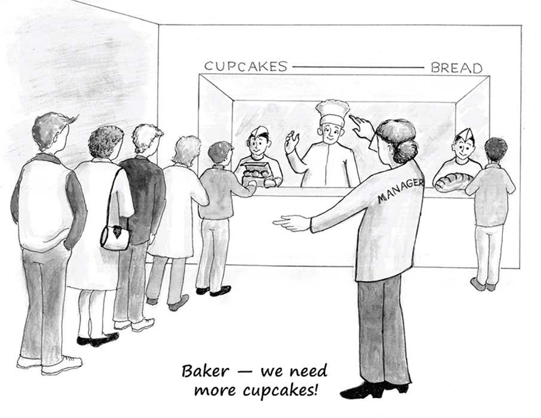

# 5. 第三章：个体繁荣和自发秩序

The Essential Hayek 翻译

## 第三章 Individual flourishing and spontaneous order 个体繁荣和自发秩序

 \[T\]he individuals should be allowed, within defined limits, to follow their own values and preferences rather than somebody else’s; that within these spheres the individual’s system of ends should be supreme and not subject to any dictation by others. It is this recognition of the individual as the ultimate judge of his ends, the belief that as far as possible his own views ought to govern his actions, that forms the essence of the individualist position.

Friedrich Hayek \(1944\). The Road to Serfdom. In Bruce Caldwell \(ed.\), The Road to Serfdom, II \(Liberty Fund Library, 2007\): 102.

在限定的范围内，应该允许个人遵循自己的而不是别人的价值和偏好，而且,在这些领域内，个人的目标体系应该至高无上而不屈从于他人的指令。就是这种对个人作为其目标的最终决断者的承认，对个人应尽可能以自己的意图支配自已的行动的信念,构成了个人主义立场的实质。（《通往奴役之路》，第五章，哈耶克）

\*\*\*

If Betty the baker notices that the price of cupcakes is rising relative to the price of white bread, she will shift some of her effort — along with some of her flour, yeast, and space in her oven — from baking white bread to baking cupcakes.

贝蒂是个面包师，假如她注意到纸杯蛋糕的价格相对于白面包上涨了，她就会将一部分精力，连同一部分面粉、酵母和烤箱空间，从制作白面包转移到制作纸杯蛋糕上去。

From Betty’s point of view, the higher price that she can now fetch for her cupcakes is a signal that she can earn more profits by baking and selling more cupcakes. From the economist’s point of view, the higher price of cupcakes means that consumers now want additional cupcakes more intensely than they did yesterday. An extra cupcake produced and sold today creates more consumer satisfaction — or, to use economists’ preferred term, more “utility” — than did an extra cupcake produced yesterday. The rising price of cupcakes reflects an important change in consumer wants. This rising price also motivates suppliers to respond in ways that meet those changing consumer wants.

从贝蒂的角度来看，纸杯蛋糕上涨的价格能让她赚取更多的利润。从经济学家的角度来看，价格上涨意味着消费者比起之前想要更多的纸杯蛋糕。比起昨天，今天多制作和销售的纸杯蛋糕给消费者带来更多的满足，或者用经济学术语来说———效用。纸杯蛋糕上涨的价格既反应了消费者需求的重要变化，也激励着生产商相应地增加产量来满足这种变化。 

A market economy, then, achieves two important goals simultaneously. \(By “market economy” I mean an economy in which there are no legal restraints on how far and in what direction prices can move; in which private property rights are secure; and in which people are largely free both to earn their incomes as they individually choose and to spend their incomes as they individually choose\).

市场经济（指法律对价格没有任何管制、私有产权得到安全保护、人们在赚钱和消费的方式上都享有极大自由的经济）就这样同时达成了两个重要目标。

First, a market economy permits self-interested people to prosper economically only by serving the interests of others. The greediest businessman can profit only by offering consumers deals that consumers value. Likewise, the greediest consumer can get what he or she wants only by paying suppliers amounts that suppliers find attractive. Adam Smith, the Scottish philosopher who is the acknowledged founder of modern economics, famously described this process: “It is not from the benevolence of the butcher, the brewer, or the baker, that we expect our dinner, but from their regard to their own interest. We address ourselves, not to their humanity but to their self-love, and never talk to them of our own necessities but of their advantages.” Second, prices set in market economies “tell” people just how they can best serve others’ interests. Prices are the single most important sources of information for producers and consumers on what they can expect from others in market economies.

首先，市场经济允许自利者通过为他人提供服务、满足他人的需求来实现富裕。最贪婪的商人也只能通过给顾客提供价值来获取利润。同样的，最贪婪的顾客也只能通过支付让卖家满意的数额来获得他想要的商品。苏格兰哲学家、公认的现代经济学的奠基者亚当斯密对此有一段著名描述：“我们不能借着向肉贩、啤酒商、或面包师傅诉诸兄弟之情而获得免费的晚餐，相反的我们必须诉诸于他们自身的利益。我们填饱肚子的方式，并非诉诸于他们的慈善之心，而是诉诸于他们的自私。我们不会向他们诉诸我们的处境为何，相反的我们会诉诸于他们的获利。”其次，市场经济下的价格“告诉”人们怎样更好的满足他人的需求。价格是生产者和消费者了解他人预期行为最重要的信息来源。

As George Mason University economists Tyler Cowen and Alex Tabarrok describe it, “A price is a signal wrapped up in an incentive.”

就如乔治梅森大学的经济学家Tyler Cowen和Alex Tabarrok所描述的：“价格是由激励包裹着的信号。”

A market economy, therefore, expands the ability of each of us to pursue our own goals by harnessing the cooperation of others. Try as you might on your own, you could never get yourself from, say, Montreal to Vancouver in a mere five hours without the help of countless others. From the pilot who flew the jetliner, to the oil-field worker who helped produce the aviation fuel, to the engineer who assisted in designing the jet’s engines, to millions of other specialized producers. Their efforts expand your range of choices; their unique knowledge and skills give you options to do that which you would never in a million years be able to do without them. Clearly, this expansion by market economies of the range of options open to each of us is a central and marvelous feature of modern life. \(Again, ask yourself how much of what you consume daily could you, personally, produce with only your own knowledge and your own hands.\) But this option-expanding role of market economies serves more than narrow materialistic purposes. It also expands the range of our “higher” options.

因此，市场经济扩展了人们通过与他人合作来实现自我追求的能力。例如不管你如何尝试，你都不可能在没有无数人帮助的情况下在五个小时内从蒙特利尔到达温哥华。从开飞机的飞行员，到生产航空燃油的油田工人，到协助设计飞机引擎的工程师，到成千上万其他专业化生产者，是他们的努力让你有了更多的选择。他们各自独有的知识和技能让你能做到过去百万年里都做不到的事。市场经济给我们带来的这种可选机会的扩展显然是现代社会一个核心且令人惊叹的特征。（不妨再扪心自问，假如你只依靠自己生产，你每天能生产多少你每日购买的东西）而且市场经济这种扩大选择范围的功能并不只局限于物质，它也能扩展更“高级”的选择。

With greater wealth, each of us can better afford — if we choose — to take more leisure. Likewise with education: markets \(to the extent that governments allow them to operate\) make education both more affordable and better over time. We denizens of modern market economies have access not only to more brands of beer and larger flat-screen TVs but also to sublime recordings of Bach cantatas and Verdi operas, to affordable volumes of Shakespeare and Tolstoy and Hemingway, to safe travel to historically significant cities such as Athens and Rome, and to medical and dental care that the likes of King Louis XIV, Queen Victoria, and even John D. Rockefeller never dreamed of.

当拥有更多财富时，只要我们愿意，我们就能有资本享受更多的闲暇。教育的情况也类似，市场（在政府允许的范围内）让教育变得更好的同时也变得更易于负担。生活于现代市场经济的我们享受着不仅是更多牌子的啤酒和更大的平板电视，还有美妙的巴赫乐曲和朱塞佩·威尔第的歌剧的录音；便于阅读的莎士比亚、托尔斯泰和海明威的作品集；去雅典或罗马等历史古城一游的安全旅程；以及路易十六、维多利亚女王、甚至洛克菲勒都无法想象的医疗和口腔护理服务。

Yet the market expands our range of individual choices in an even more profound way: by its very nature, a market economy is one in which individuals are not herded together and assigned tasks under a single plan. Unlike in a firm or other organization that pursues a single goal — such as “make as much profit as possible by producing and selling automobiles” — a market economy is not aimed at attaining one unitary goal to which everyone in society must subordinate her own desires and plans.

市场还通过它的本性，以一种更深刻的方式扩展我们的选项。市场经济并不是把人们聚集到一块然后按一个中央计划分配任务。公司或其他单目标组织的目标可能就是“通过生产销售尽可能多的汽车来赚取最大利润”，但市场不同，市场经济并不以让社会里的每个人放弃各自的欲望和计划以实现某单一目标为目的。

In a market economy only basic and abstract rules are enforced — chiefly, the laws of property, contract, and tort, along with criminal sanctions against the initiation of violence, theft, and fraud. And these rules are almost all negative, in that they do not tell individuals what to do but, rather, only what not to do. The result is that each individual has wide scope to formulate his or her own plans — and wide scope in choosing just how to pursue those plans — without having first to secure permission from some authority.

市场经济只要求执行一些基本的抽象规则，主要有关于产权、合同、侵权的法律和对犯罪行为如暴力、盗窃、欺诈的惩罚。而且这些规则基本都是否定式的，即它们并不是告诉个体该做什么，而是不该做什么的。结果就是个人对于如何制定计划、如何执行计划有着宽广的选择权，而无需事先通过某些权威机构的安全审核。

The laws and norms of what Hayek called “the Great Society” are not designed to maneuver individuals into particular places to achieve some overall, grand, concrete social outcome. Nor are these laws and norms judged by how well they do any such maneuvering. The reason is that the Great Society is one that gives each person maximum possible scope to formulate and pursue his own individual plans; it is not a society in which people are treated as the means to some higher ends.

哈耶克称为“伟大社会”里的法律和规则并不是设计来调遣个人去某个地方做螺丝钉以实现一些整体、宏大、具体的社会目标。这些法规的好坏也不是按照它们在多大程度上实现这种调遣来评判的，因为伟大社会是一个给予个体构想和实现自我计划最大可能性的社会，它并不把个体当做通向某种更高目的的手段。

That the Great Society gives to each individual maximum possible scope to live as he or she sees fit is, perhaps ironically, one reason that many people dislike it. The Great Society itself offers no higher purpose to which people can commit themselves. The Great Society doesn’t ask individuals to consciously come together in any thrilling collective endeavour.

可能有点讽刺，不过有些人恰恰因为伟大社会给予个体最大程度的自我选择而讨厌它。伟大社会并不提供更高级的目标供人们献身，也不刻意要求人们亢奋地共同努力。

Yet this fact doesn’t mean that there are no higher purposes for individuals to pursue. In the Great Society each individual can choose and pursue his own purposes — including high and noble ones. And the individual can do so in league with as many other people as he can persuade to join him. Contrary to a popular assumption, therefore, higher purposes need not be supplied by “society.” These purposes can be chosen and defined by individuals interacting peacefully with each other within the Great Society. And among the beautiful features of this fact is that no one is forced to work for goals that he finds disagreeable, offensive, unworthy, or unobtainable.

不过这并不意味着不存在值得个体追求的更高目标，只不过在伟大社会里个体可以选择和追求他自己的目标，包括那些高贵的目标。只要能说服别人，个体也可以组成任意大的群体来实现目标。因此与流行的看法相反，高级的目标并不需要由“社会”提供，而可以由伟大社会里和平相处的个体们选择和制定。这一事实的美丽之处在于没人会被强迫去实现他觉得不能苟同的、无礼的、没价值的或者无法实现的目标。

Perhaps ironically, by allowing the maximum possible freedom for each person to pursue his or her own chosen goals, the result is an overall social order that very much deserves to be described as “Great.”

可能有点讽刺，正因为给予个体选择目标的最大自由，所产生的整体社会秩序反而最有资格被称作“伟大”。

