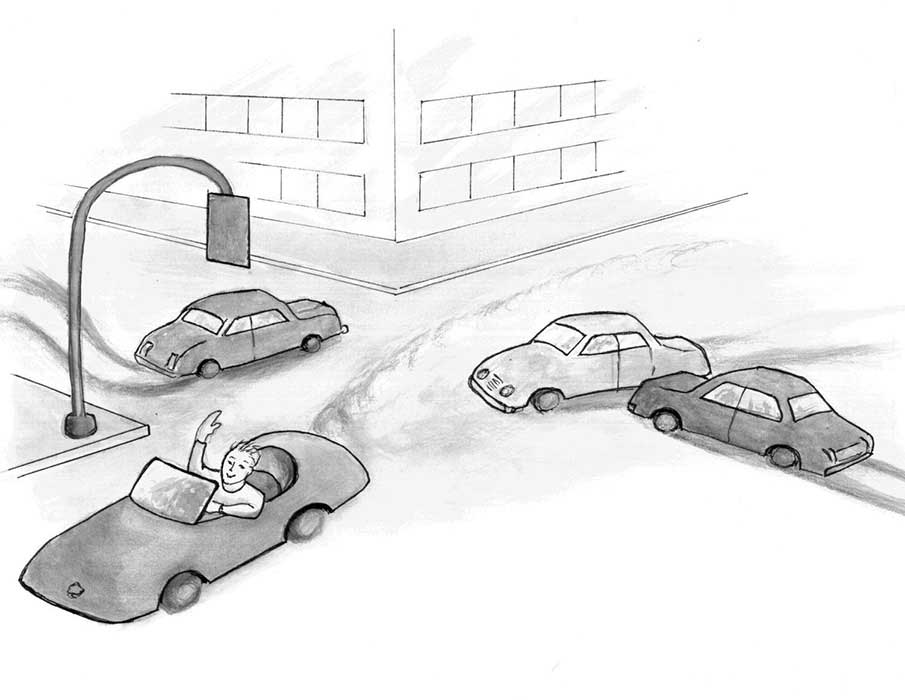

# 6. 第四章：法治、自由、和繁荣

The Essential Hayek 翻译

## 第四章 The rule of law, freedom, and prosperity 法治、自由、和繁荣

 The conception of freedom under the law ... rests on the contention that when we obey laws, in the sense of general abstract rules laid down irrespective of their application to us, we are not subject to another man’s will and are therefore free.

Friedrich Hayek \(1960\). The Constitution of Liberty. In Ronald Hamowy \(ed.\), The Constitution of Liberty, XVI \(Liberty Fund Library, 2011\): 221.

法律之下的自由……是以这一观点为依据：当我们遵守那些不管实际上是否会应用到我们身上而被判定出来的一般的抽象准则时，我们并不会屈从于他人的意志，因而我们是自由的。（《自由宪章》，哈耶克，1960）

\*\*\*

As we saw earlier, our modern prosperity springs from the use of the knowledge of millions of diverse individuals spread across the globe. This knowledge is typically very detailed, local, and quickly changing. No government can ever collect such knowledge and then properly digest and productively act upon it. The only practical way we know to ensure that as much of this knowledge as possible is discovered, properly digested, and productively acted upon is to rely upon millions of people each to discover a few “bits” of this knowledge and then, individually, to put each of those bits to use. By dividing among millions of people the task of discovering and acting upon knowledge, no one person is overwhelmed with having to absorb and use more knowledge than is humanly possible.

如我们之前讨论的，我们享受的现代繁荣源于对全世界数亿人的分散知识的利用。这些知识往往细碎、局部、变化很快。没有任何政府能够收集这些信息、加以理解并据之有效地做出决策。目前已知的唯一有效地发现、理解这些信息并据之高效行动的办法就是依赖亿万人各自去发现零碎的信息并加以独立运用。通过把发现和使用信息的任务拆分给亿万人，每个人需要吸收、利用的知识就不会超出人类的能力范围。

It is important to understand that without freedom, individuals are confined to behave only in ways permitted by government authorities. Unfree people, therefore, have less scope and ability than do free people to search for and to act upon such detailed and local knowledge.

理解以下这点很重要：如果没有自由，个体行动就会受限于政府权威。因此不自由的人寻找并利用零碎、局部性的知识的能力就弱于自由的人。

One important reason for dividing among millions of people the tasks of discovering and acting upon small bits of knowledge is that no central authority can know how to order these people about and know what they will discover. But how to ensure that free people — without being directed by some wise and all-knowing central authority — will actually find this knowledge and put it to productive use? How can we be sure that free people will not act selfishly in ways that further their own individual interests at the expense of the general welfare?

把发现并利用零碎知识的任务分拆给亿万人的一个重要理由在于没有任何中央权威可以明白怎么安排人们去找到这些知识，中央权威也不可能知道人们会发现些什么样的知识。那问题来了，如何确保没有无比智慧、全知全能的中央权威指导的自由人能够找到这些知识并加以有效利用呢？我们如何确保自由人不会以损害公众利益的自利方式行动呢？

One part of the answer is that in fact we do expect people to behave in their own self-interest, but that self-interested behaviour ends up working to everyone’s benefit. In a market economy, producers want to become as wealthy as possible, but to do so they must compete against each other for consumers’ patronage. This system rewards success at pleasing others \(consumers\) and punishes, with economic losses, the failure to do so. Another part of the answer, though, is the rule of law. The rule of law is a system of rules that are impartial and applied equally to everyone — even to government officials. If everyone is bound by the same rules, no one gets to bend those rules to his or her own advantage.

答案部分在于我们确实预期人们会以自利的方式行动，但他们自利的行为最终会使公众受益。市场经济下，生产者希望变得尽可能富裕，为此他们必须与其他生产者竞争来赢得消费者。这个体系在经济上奖励那些满足消费者的人，惩罚那些做不到的人。答案的另一部分在于法治。法治是由平等适用于每个人（甚至政府官员）的不偏不倚的规则组成的体系。如果每个人都受制于相同的规则，就没有人能扭曲这些规则以谋私利。

A rule is impartial if it is not formulated to achieve particular outcomes. An impartial rule only constrains people from acting in ways that are widely regarded as harmful. These are mostly “thou shalt not” rules rather than “you are hereby commanded” rules.

一个中立的规则指的是它不是为了获得某种特定结果而制定的。中立的规则只限制那些公认的有害行为。这些规则一般是关于“你不该做什么”而不是“你被命令去做什么”。

Rules of the highway are a good example. The rules of driving, such as speed limits and traffic lights, do not aim at directing drivers to particular locations. Specific destinations, as well as the particular routes that drivers use to travel to different destinations, are for each driver to decide. The rules of the road are not meant to determine where drivers go or how they get there. Instead, these rules are meant simply to give each driver maximum possible scope for getting to his destination, by whatever route he chooses, as safely and as reliably as possible while also ensuring the safety of all other drivers.

关于高速公路的规则就是个很好的例子。关于限速和红绿灯的交规并不是为了指示司机开去特定地点。具体的目的地、该开哪条道，都是由司机自行决定的。道路法规不是为了决定司机该去哪、怎么去的，而是为了在目的地和路径方面给予每位司机最大选择权的情况下，使他们尽量安全可靠地到达目的地，同时也要保证所有其他司机的安全。

Supplying this assurance to each individual driver means holding every driver to the same rules. If some class of drivers \(say, red-headed people\) were free to ignore traffic lights, then the value of traffic lights to all other drivers would be greatly reduced. A driver approaching an intersection when the light in his lane is green would still have to slow down and look to ensure that no red-headed driver is barreling through the intersection. Traffic accidents would increase and traffic flow would slow down.

这种保障意味着对每个司机施加同样的规则。假如某些司机（比如红头发的司机）可以随意地无视红绿灯，那红绿灯对其他司机的价值将会大打折扣。一个面对绿灯的司机仍然得减速观察以确保没有红头发司机正在通过。交通事故将会增多而车流速度将会减慢。 

Holding all drivers impartially to the rules of the road results in every driver forming a reliable set of expectations about how other drivers will act. Every driver in North America expects all other drivers to drive on the right-hand side of the road. The result is that each driver can move faster because she is freed from the need to consciously be on guard against on-coming cars being driven in the left-hand lanes. The same is true for traffic lights, yield signs, stop signs, and the many other rules of the road that drivers routinely, and typically without thinking, obey. These rules of law-of-the-road direct every driver to act in conformity with every other driver’s expectations.

公正地对每个司机运用规则会让司机们形成其他司机会如何行动的可靠预期。北美的司机们都预期其他司机也会靠右行驶，结果所有人都可以开的更快了，因为他无需留意是否会和靠左行驶的车迎面撞上。同样的道理适用于红绿灯、避让标志、停车标志、和许多其他司机们一般下意识就会遵守的标志。这些道路交通法规引导着每位司机以符合其他司机预期的方式行动。

Of course, the rules aren’t perfect. Sometimes they are violated. And those violations every now and then result in traffic accidents. But the fact that drivers occasionally run red lights or drive on the wrong side of the road does not mean that the rule of law doesn’t prevail on our streets and highways. If drivers are confident that the rules of the road will generally be obeyed, they won’t hesitate to use their automobiles to travel to and fro in order to pursue their own individual goals.

当然，这些规则并不完美，有时候还是会有人违规。时不时的违规导致了交通事故。尽管偶尔有人闯红灯或者逆行，这些规则依然是道路上的主流规则。如果司机们对交通规则的遵守程度有信心，他们就会毫不犹豫地开着车去追求他们各自的人生目标。

But if drivers lose confidence that the rule of law will prevail on the road, then driving becomes a less useful mode of transportation. Red-headed drivers \(as in my earlier example\) who are entitled to run red lights might indeed arrive at their destinations sooner than they otherwise would, but the vast majority of people will find automobile driving to be less useful than it would be if the rule of law were universally applied. People will drive less and encounter more difficulties en route. The erosion of the rule of the law on the roads will obstruct the ability of people to achieve as many travel goals as they would if the rule of law were fully enforced and applicable to everyone.

但是如果司机们失去了这种信心，开车就变成了比较没用的运输方式。前例中被允许闯红灯的红头发司机可能可以更快地到达目的地，但其他大部分司机会发现开车没那么有用了。人们会更少开车，也会在在路上遇到更多的困难。道路法规的腐蚀使得人们无法实现像公平情况下那么多的出行目标。

What’s true of the rule of law on the roads is true of the rule of law more generally. When all people, including the highest government officials, are bound by the same general and impartial rules, every individual enjoys the greatest possible chances of achieving as many as possible of his own chosen ends. True equality reigns.

对交通法规适用的这套逻辑也适用于更一般的法律法规。当所有人，包括最高级政府官员，也得遵守通用的公正的法律，每个个体就能尽可能多地选择自己的目标，并且有着最大的可能去实现它。真正的平等大行其道。。

This equality is equality before the law. It does not guarantee equality of outcomes. But it does mean that no person’s or group’s interests are given extra weight or are singled out to be discounted. The result is that no person’s or group’s interests are sacrificed so that other persons or groups might enjoy special privileges. In this way a society is truly one of law and not of men.

这种公平是法律面前的公平。它并不保证每个人都获得相同的结果，但它确实保证没有个人或组织的利益被特别对待。结果是不会有一些个人或组织的利益因另一些个人或组织的特权而牺牲。这样的社会就是真正的法治而非人治。

The actual move toward greater and greater equality before the law over the past 200 or so years, in turn, reduced the role of “identities,” such as accidents of birth, of skin colour, or of religious affiliation in determining a person’s success or failure in life. Success or failure came more to be determined by character and merit — that is, by success or failure at cooperating on equal terms with other people, especially in producing useful goods and services for the market. The rule of law, therefore, plays a key role in securing not only our freedoms but also prosperity for as many individuals as possible.

过去约200年里法律面前人们越来越平等，这削弱了诸如出身、肤色、宗教信仰等个人身份的重要性，它们对个人生活的成败不再有那么大的影响。个人成败更多地取决于性格和品质，即与他人平等合作，特别是为市场生产有用的商品和服务，的能力。因此，法治不仅在确保我们个人自由上扮演关键角色，也是给尽可能多的人带来繁荣的关键角色。

