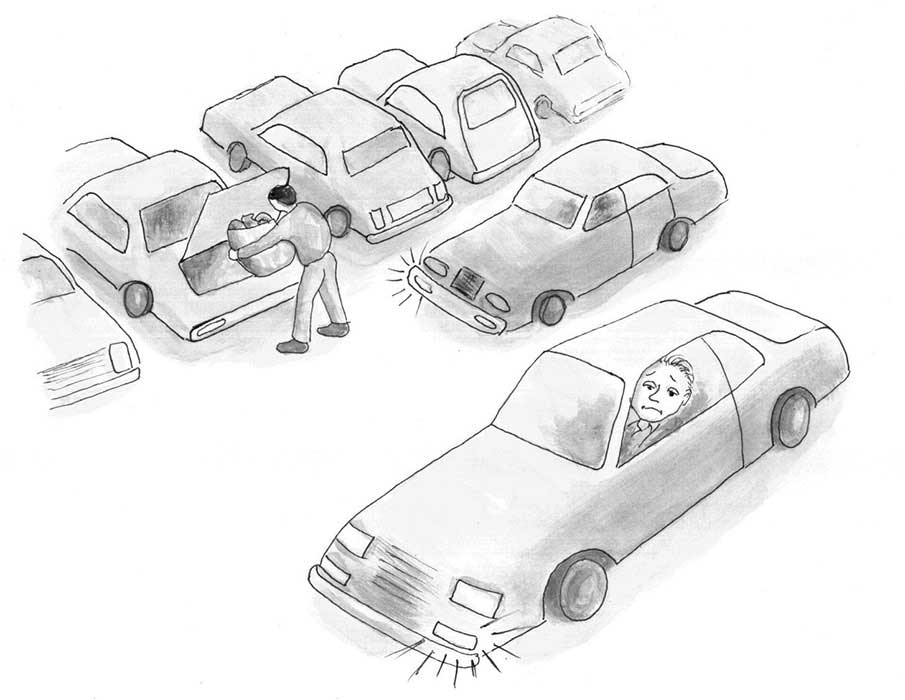

# 7. 第五章：立法不同于法律

The Essential Hayek 翻译

## 第五章 Legislation is distinct from law 立法不同于法律

 Legislation, the deliberate making of law, has justly been described as among all inventions of man the one fraught with the gravest consequences, more far-reaching in its effects even than fire and gun-powder. Unlike law itself, which has never been ‘invented’ in the same sense, the invention of legislation came relatively late in the history of mankind. It gave into the hands of men an instrument of great power which they needed to achieve some good, but which they have not yet learned so to control that it may not produce great evil.

Friedrich Hayek \(1973\). Law, Legislation, and Liberty, 1 \(University of Chicago Press\): 72.

立法, 即以审慎刻意的方式制定法律，已被论者确当地描述为人类所有发明中充满了最严重后果的发明，其影响甚至比火的发现和火药的发明还要深远了。然立法不同于法律本身，法律从来不是像立法那样被“发明”出来，而立法的发明在人类历史上是较晚才出现的。立法这种发明赋予了人类以一种威力无比的工具——它是人类为了实现某种善所需要的工具，但是人类却还没有学会控制它，并确使它不产生大恶。（《法律、立法与自由》，第一卷第四章，哈耶克）

\*\*\*

The single most profound advance in our understanding of society was made in the eighteenth century by a remarkable group of Scottish philosophers, foremost of whom were David Hume and Adam Smith. These Scots explained that \(to quote another Scot of that age, Adam Ferguson\) “nations stumble upon establishments, which are indeed the result of human action but not the result of human design.”

对我们理解社会推进最大的一次进步是由一批苏格兰哲学家于十八世纪做出的，其中最重要的是大卫·休谟和亚当·斯密。用当时另一个苏格兰哲学家亚当·福格森的话说，这些苏格兰人解释了“国家是如何跌跌撞撞地构建的，它固然是出于人们的行动，但并不是按照任何人的设计而完成的。”

A good example is language. No one invented language. No person or council designed it. Each language evolved over the generations into the particular “shape” — vocabulary, grammar, syntax — that it has today. No genius or committee of the best and the brightest linguists invented, for example, the word “chair” to mean in English an object in which humans sit. No language designer decreed the word “merci” to convey the meaning that French speakers understand whenever they hear or say that word. Word meanings evolved over time through repeated use and experience. Likewise for each language’s grammar and syntax.

一个很好的例子是语言。没人发明语言。没有任何人或理事会设计了语言。每种语言，它的词汇、语法、句法，都是在时间的长河中慢慢演化现在这副模样。拿英语里的“椅子”这个词为例，它并不是任何天才或者由最好最聪明的语言学家组成的委员会发明的。没有任何语言设计者颁布法令规定“merci”这个词得是现在说法语者所理解的意思。词义是在重复的使用和经历中随时间演化的。语法和句法的情况也类似。

Languages are unquestionably the result of human action — in this case our and our ancestors’ countless individual efforts in particular circumstances to convey meaning to others. \(“Watch out for that falling rock!” “I love you.” “Take that hammer to your father.”\) But none of the thousands of natural languages that have existed in history is the result of human design. None of these languages — not English, not French, not Urdu, not Chinese, not one — was invented. And yet each language is a remarkably useful tool for people who speak it to communicate in complex ways with each other.

毫无疑问语言是人类行为的产物，是我们和前人无数个体努力在特定场合向他人传递意思的产物。（例如“注意落石！”，“我爱你”，“把那把锤子拿给你爸”）但是历史上出现过的上千语言里没有一个是人类设计出来的。没有一种语言——英语不是，法语不是，乌尔都语不是，汉语不是，统统都不是发明出来的。尽管如此，每种语言依然是让人有效进行复杂交流的利器。

Of course, once a language becomes established it is common for lexicographers to codify that language in dictionaries, thesauruses, and books of grammar. Samuel Johnson’s eighteenth-century A Dictionary of the English Language is an example of a famous codification of the English language. Such codifications, however, do not create any language. Samuel Johnson did not create English; he merely recorded it as he found it in its evolved state in the mid-1700s. If Dr. Johnson had written in his dictionary that the word “chair” means “to kill in cold blood,” people would not suddenly have started using “chair” as a synonym for “murder.” Instead, people would have simply regarded Dr. Johnson’s dictionary to be untrustworthy.

当然，当一种语言成形后，通常词典编纂者就会把它编成字典、同义词库和语法书。塞缪尔·约翰逊于18世纪为英语编纂的《约翰逊字典》是个著名的例子。但是此类编纂并不创造语言。塞缪尔·约翰逊并没有创造英语，他只是记录他所观察到的18世纪中期英语的演化状态。假如约翰逊博士在他的字典里把“椅子”解释为“冷血地杀害某人”，人们并不会突然就开始把“椅子”当做“谋杀”的同义词，他们只会觉得这部字典没什么价值。

What is true of language is also true of law. The great bulk of law that governs human interactions was not invented and designed by some great Law Giver. Instead, law emerged without centralized design. Law evolved.

语言的这套规则也适用于法律。大量约束人类互动行为的法律并不是由什么伟大的立法者发明设计的。它们是在没有中心设计者的情况下涌现出来的，法律是在演化的。

The law against murder, for example, is not the product of human intention or design. There was never a tribe or society in which the intentional taking of the lives of peaceful members of that tribe or society was acceptable and became unacceptable only when and because some elders, a wise leader, or a popularly elected assembly pronounced such killing to be wrong. Such killing is, to use a phrase from Anglo-American law, malum in se ‐ it is wrong in itself. People do not tolerate murder in their midst; in some form or fashion they take steps to prevent murder and to punish — usually very harshly — those who commit it. Such steps are taken even when there is no formal government to lead such efforts. The same is true for theft, fraud, arson, and many other violent and aggressive acts initiated against the persons and property at least of the people regarded to be citizens of the group.

举例来说，惩治谋杀的法律并不是人类意图或设计的产物。从来没有过这样一个部落或社会，蓄意杀害和平的组织成员一开始被认为是可接受的，直到一些老者、睿智的领袖或者公众选出的一些人宣布谋杀为非法。这种谋杀，用盎格鲁撒克逊法的术语来说，本身就是错的（_malum in se_）。人们对谋杀并不容忍，他们还会采取各种步骤预防谋杀，并往往严厉地惩罚谋杀者。即使在没有正规政府领导的地方，我们也可以观察到这些步骤。同样的道理适用于盗窃、诈骗、纵火和其他许多暴力和侵犯性行为，至少当这类行为的对象是同一族群成员的人身和财产时定然如此。

Some of these laws might be rooted in humans’ genetic make-up. \(Parents naturally will go to enormous lengths to protect the lives of their children and to ensure that their children’s killers are punished appropriately. Similar, if less intense, sentiments are naturally felt for other family members and friends.\) Other laws might be based more on mere social and religious conventions — such as the law that women in western societies, unlike in some African tribal societies, never appear topless in public or that women in many societies must never appear in public with their hair uncovered.

这些法律的一部分可能根植于人类的基因。（例如家长自然地会做出大量努力来保护子女的生命和确保杀害他们子女的凶手得到恰当的惩罚。对其他家庭成员和朋友，人们也会自然地有这种情绪，虽然可能轻微一些。）其他法律可能更多基于社会和宗教传统，例如不像非洲部落社会的妇女，西方妇女不会在公众场合赤裸上身，或者有些社会的妇女在公众场合从来不许露出头发。

What matters here is that every day we obey a vast set of rules that are not consciously designed.

这里的要点在于我们每天都遵守着大量并非有意设计的规则。

Consider how parking spaces in shopping malls are allocated on busy shopping days. Suppose that you and several other drivers are cruising around a crowded parking lot, each in search of a parking space. You eventually spot a car just beginning to pull out of a space. You will likely stop a few feet behind that parking space and turn on your car’s blinker in its direction. When another driver, also looking for a parking space, sees your stopped car with its blinker on, that other driver immediately knows that you are claiming that about-to-be-abandoned space. That other driver, although disappointed that she missed out on the space, will nevertheless drive past you to continue looking for a space; that other driver leaves the space for you to occupy.

考虑一下商场忙时的停车位是如何分配的。假设你和其他几个司机正在一个拥挤的停车场寻找车位，最终你找到了一辆正准备离开的车，一般来说，你会把车停在那车后面一些的地方并打开相应的转向灯。当其他也在找停车位的司机过来时看到你停在那并打着灯，他们立刻就明白你是在对这个即将空出来的停车位宣示使用权。其他司机虽然觉得失望，但只会超过你并继续寻找车位，而把这个车位留给你。 

In this everyday example, both you and the other driver are governed by law. The first person to stop his car near a parking space being abandoned and to put his blinker on in the direction of that space is widely recognized as having established for himself a temporary property right to that space. It is a right that other drivers generally recognize and respect.

在这个每天都发生的例子中，你和其他司机都由法律约束着。第一个停在即将空出的车位后面并打灯的人被普遍认为临时享有这个车位的产权。这种权利一般来说受到其他司机的认可和尊重。

This law is not written in any book. It was not designed by a committee of parking geniuses. It emerged, unplanned and unintended, in the course of human interactions. And it serves the useful purpose of peacefully allocating scarce parking spaces in ways that are widely accepted as being fair.

这条法律并未写在任何书中。它并不是由某位精通停车资源的天才委员会设计的。它是无人计划、在人们的互动中无意涌现出来的。它也被普遍认为是公平、和平地分配稀缺的停车资源的有效方法。

This example of spontaneously evolved law governing the allocation of scarce parking spaces is just one instance of evolved law. A much more significant body of evolved law is the _lex mercatoria_, or “Law Merchant.”

这个自发演化出来的分配停车资源的法律只是法律演化的一个例子。一个更重要的例子是商法。

When trade in the Mediterranean region began to rapidly expand a thousand years ago, disputes between merchants naturally occurred with greater frequency. There was, though, no single sovereign power with authority over all of these merchants who traded with each other — some of whom were in Genoa, others in Venice, others in Umbria, and yet others in the several other different independent political jurisdictions that were then spread throughout the Mediterranean region. Nevertheless, a highly complex and uniform system of law emerged in this large region to settle commercial disputes. This law is today known in the English-speaking world as the Law Merchant.

一千年前，当贸易在地中海地区迅速繁荣时，商家间的纠纷自然也增多了。但是当时并没有一个统治着所有商人的主权国家。有些商人在热那亚，有些在威尼斯，有些在翁布里亚，还有些处于遍布地中海区域的几个相互独立的不同政治辖区。尽管如此，一个负责处理商业纠纷、高度复杂且统一的法律体系还是在这么大的范围内涌现了出来，这套法律今天在英语世界被称作商法。

Two features of the Law Merchant are worth emphasizing here.

商法有两个值得强调的特点。

The first is that the Law Merchant evolved spontaneously out of the actions of merchants; it wasn’t designed and imposed by a king, military general, or parliament. Routine merchant practices came to be known by the merchants and these routines created expectations in all merchants about how they and their fellows would act under different circumstances. But conflicts arose when these expectations were violated — either intentionally or unintentionally — or when new occurrences happened that were out of the ordinary. Merchants themselves established and manned courts to settle these conflicts. These courts generally ruled in favour of those parties whose actions were most consistent with established merchant practices — and, hence, these courts generally ruled against those parties whose actions were deemed to have run counter to established merchant practice.

首先商法是在商人的互动中涌现出来的。它并不是由某位国王、将军或者议会设计施行的。常规的商业做法渐渐为商人所熟悉，并让所有商人对他们和其他商人在不同情况下该如何行动形成了预期。当这些预期被有意或无意地违反，或者出现了新的非常规情况，冲突就发生了。商人自己组建了法庭来化解这些冲突。这些法庭通常青睐那些与既成预期最吻合的行为，反对那些被认为违背预期的做法。

In much the same way that lexicographers look to widely accepted and established meanings of words when declaring in their dictionaries the meanings of words, Law Merchant courts looked to widely accepted mercantile practices to settle disputes and declare the law in the cases before them. Through this process, law is created and modified by ongoing human practices and interactions, and this law is further refined and spelled out in decisions by these courts. The important feature for our purposes is that no one designed this law. It is the result of human action but not of human design.

词典编纂者通过观察被广泛接受的词意来撰写词条，非常类似地，商法法庭通过观察被广泛接受的商业行为来解决纠纷并在案件中宣示法律。这样法律就随着人们的行为和互动不断被创立和修改，并在法庭判决中被进一步提炼和公告。这里的重点在于没人设计了这些法律，它们是人类行为，而非设计，的结果。

A second feature of the Law Merchant is that it was widely obeyed even though there was no government to enforce it. For starters, each merchant typically had powerful incentives on his own to follow the law — in the same way that you have incentives to follow the law of allocating parking spaces in crowded parking lots. By “breaking the law,” you risk retaliation by others. Other drivers honk angrily at you and perhaps even confront you face-to-face to scold you for your offense. \(Violating the law of allocating parking spaces usually causes only minor problems for others, so the punishments typically inflicted on violators of this law — nasty looks, repeated horn blowing, a few angry words, and the like — are correspondingly minor.\)

商法的第二个特点是尽管没有政府来执行，它仍被广泛遵守。首先，一个典型的商人有着遵守商法的强烈动机，正如你有遵守停车位分配规则的动机。如果你违反了法律，你就得冒被他人报复的风险。其他司机会愤怒地向你鸣笛，甚至当面责骂你的冒失。（违反停车位分配规则一般只给他人带来些小麻烦，所以对违反者的惩罚一般也比较轻微，就是些臭脸、反复鸣笛、几句怒骂等等。）

For merchants, violating the Law Merchant risked severe damage to their professional reputations. A trader who didn’t pay his debts on time, or who refused a certain shipment of supplies in situations when established commercial practice required that he accept that shipment, was a trader who lost future opportunities to borrow and trade with other merchants. Because those future opportunities were valuable, merchants had strong personal incentives to maintain their reputations for being law-abiding. And the best way to get and keep such a reputation was actually to be law-abiding.

对商人来说，违反商法可能会严重损害他的职业声誉。未能按时还债，或者拒收一批习俗认为应该接收的货物都会让一个商人失去未来与他人借贷和交易的机会。因为未来的这些机会很宝贵，商人就有强烈的私人动机去维护自己守法的名声，而维护名声的最好办法就是真的守法。

It’s no surprise, then, that the historical record shows that even when merchants lost cases decided by Law Merchant courts they typically obeyed the rulings. The merchants obeyed not because the government forced them to obey; again, in most cases there was no government available to enforce a Law Merchant court’s ruling. Merchants obeyed the courts’ rulings because to disobey those rulings would damage their own reputations.

因此当看到历史记录显示商人在败诉时一般也会服从判决时，我们就不必惊讶了。商人选择服从并不是因为政府迫使他们这么做，再强调一遍，大多数情况政府都没有参与。商人服从判决是因为不服从会损害他们的声誉。

Today’s method of allocating scarce parking spaces and the Law Merchant are just two of many examples of law that is created spontaneously and isn’t necessarily written in statute books. Law is not always legislated, but it is generally obeyed.

分配停车位的规则和古代商法只是两个法律是自发创建而不必写在成文法典里的例子。法律并不总是由政府立法，但它依然往往得到遵守。

Of course, in addition to obeying the many laws that are not consciously designed we obey also many rules that are consciously designed. Rules consciously designed by government are “legislation.” We obey legislation, though, only because government will fine, imprison, or execute us if we do not obey. And while we might respect the authority of government, we respect and obey legislation only because it is created and enforced by government. Unlike law, the actions declared wrong by legislation are wrong only because government prohibits them. These wrongs are malum prohibitum — wrong only because government says they are wrong.

当然，除了遵守众多未经有意设计的法律外，我们还要遵守许多有意设计的法律。由政府有意设计的规则被称作“立法”。我们遵守立法，不过那是因为不然政府会惩罚、囚禁或者处决我们。虽然我们可能尊重政府的权威，但我们仅仅是因为立法是由政府创立并执行的才去尊重和遵守它。不同于法律，被立法认定为错误的行为仅仅是因为政府的禁止。这些错行被称作_malum prohibitum_，意思是“仅仅因为政府说它是错的”。

Importantly, however, the mere enactment of a piece of legislation doesn’t necessarily give the legislature’s intention the force of law. While legal rules need not be created by a sovereign authority and written in a statute book to operate as genuine law, it is also the case that rules written in a statute book \(“legislation”\) are not necessarily binding.

而且重要的是，立法的通过并不必然保证它被有效执行。就像生活中真正在运行的法律规则不必由国家权威创立并写入成文法典，写入成文法典的立法也未必就能有约束力。

For example, according to the written criminal code of the State of Massachusetts, it is a criminal offense for two unmarried adults to have consensual sex with each other. Yet despite the fact that this prohibition against consensual pre- and extra-marital sex was duly enacted by the Massachusetts legislature and is clearly written in that state’s legislative code, consensual pre- and extra-marital sex among adults in Massachusetts is in fact not unlawful. No police officer in that state would arrest violators of this legislation. No judge or jury there would convict even those who confess to committing this “crime.” And if by chance some completely out-of-touch police officer or court today would attempt to punish a couple for this “crime,” the public outrage would be so great that that attempt would fail. Indeed, in such a case the public would regard the police officer and the court — not the couple — as having broken the law.

举个例子，根据马萨诸塞州的刑法典，两个未婚成人间自愿的性行为是犯罪。虽然这一禁止婚前和婚外性行为的法律被马萨诸塞州的立法机构通过了并且清楚的写入州法，但成人间的婚前/婚外性行为在该州实际上并不是非法的。该州没有警察会逮捕违反这条法律的人，没有法官或陪审团会判决承认该“犯罪”行为的人有罪。而且假如今天真的有那么跟不上时代的警察或法庭试着去惩罚此类“犯罪”，公众的愤怒就会让他们知难而退。事实上，在那样的情况下公众会认为是警察和法院，而不是那对成年人，违反了法律。

The importance of recognizing the distinction between law and legislation goes well beyond semantics. Its importance is twofold.

法律和立法的区别很重要，也远不止于语义上。它的重要性有两重。

First, awareness of this distinction enables us to better see that socially beneficial rules of behaviour often emerge and are enforced independently of the state. It is a myth to believe that law is necessarily a product of conscious design by holders of sovereign authority.

首先，意识到这种区别让我们更好的明白有益社会的行为规范常常是自发涌现而非政府施加的。法律必须由权威有意设计只是个神话。

Second, regardless of the merits or demerits of government’s expansive use of legislation, the respect that we naturally feel for law should not unquestionably be extended to legislation. A corrupt or unwise government will legislate in many ways that are socially destructive. We should not confuse such government commands with law — or accord respect to legislation simply because it is commonly called “law.”

其次，不论政府对立法的扩张性使用是好是坏，我们对法律那种自然的尊重未必就该毫无疑问地扩展到立法上。一个腐败或昏庸的政府会制定许多摧毁社会的立法，我们不该把这些政府命令与法律混淆，也不该仅仅因为这些立法常常也被称作“法律”就尊重它们。

