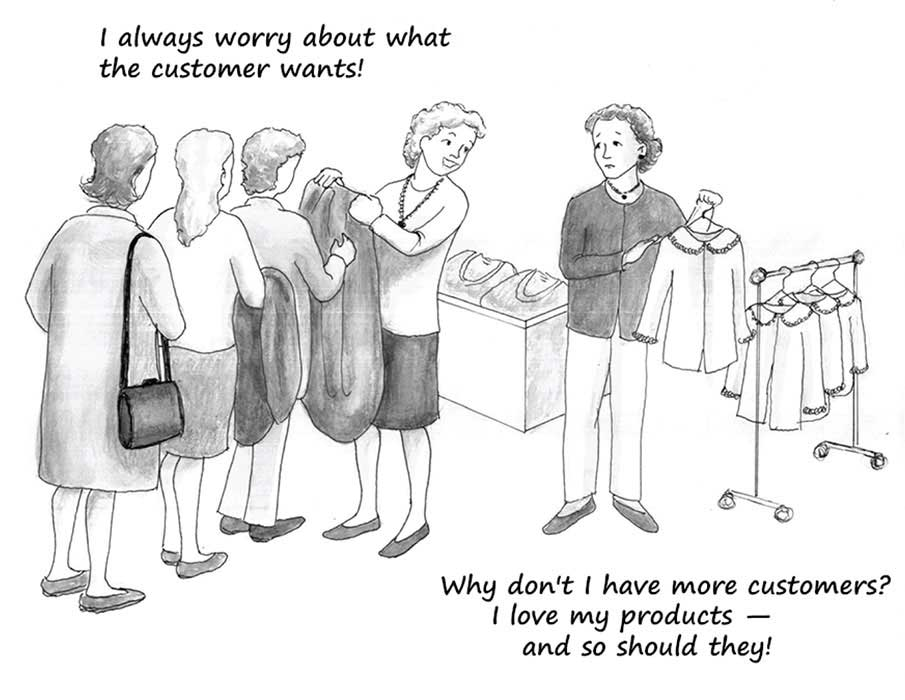

# 8. 第六章：虚假的经济安全和通往奴役之路

The Essential Hayek 翻译

## 第六章 False economic security and the road to serfdom 虚假的经济安全和通往奴役之路

 But the policies which are now followed everywhere, which hand out the privilege of \[economic\] security, now to this group and now to that, are nevertheless rapidly creating conditions in which the striving for security tends to become stronger than the love of freedom. The reason for this is that with every grant of complete security to one group the insecurity of the rest necessarily increases.

Friedrich Hayek \(1944\). The Road to Serfdom. In Bruce Caldwell \(ed.\), The Road to Serfdom, II \(Liberty Fund Library, 2007\): 153.

但是目前各处都在奉行的政策,即把有保障的特权时而给与这一集团,时而给与那一集团的政策,却很快地在造成一种对保障的追求比对自由的热爱更日趋强烈的局面,其原因是,随着每 一次把完全的保障赐予某一个集团,其余的人的不安全就必然增加。（《通往奴役之路》，第九章，哈耶克）

\*\*\*

Indispensable to the creation, maintenance, and growth of widespread prosperity is an economic system that uses scarce resources as efficiently as possible to create goods and services that satisfy as many consumer demands as possible. To the extent that the economic system encourages, or even permits, productive resources to be wasted, that system fails to achieve maximum possible prosperity. If, say, large deposits of petroleum beneath the earth’s surface remain undetected because the economic system doesn’t adequately reward the human effort required to find and extract such deposits, then people will go without the fuel, lubricants, plastics, medicines, and other useful products that could have been — but are not — produced from this petroleum.

为了创造、维持和增加广泛的繁荣，我们需要一个尽可能高效地分配稀缺资源来生产商品和服务以尽量满足消费者需求的经济体系。当一个经济体系允许或者鼓励浪费生产性资源时，它就未能实现最大可能的繁荣。举个例子，如果经济体没能给予人们足够的激励去勘探、开采石油，从而使得大量的地下石油未被探明，导致人们缺少燃料、润滑油、塑料、药物和其他本来能从石油中生产的产品，它就未能实现最大繁荣。

The system that best ensures that resources are used as efficiently as possible is free-market capitalism — an economic system based on transferrable private property rights, freedom of contract, the rule of law, and consumer sovereignty. This last feature of free-market capitalism is the right of each consumer to spend her money as she sees fit. She can spend as little or as much of her income as she chooses \(in order to save whatever she doesn’t spend\), and she can change her spending patterns whenever and in whatever ways she likes.

最能确保资源最有效利用的体系就是自由市场资本主义，一种基于可转移的私人产权、契约自由、法治和消费者主权的经济体系。消费者主权指的是每个消费者都有权任意支配他的金钱。他可以把收入全花光，或者完全不花以做储蓄，他也可以随时随意地改变消费模式。

In short, consumer sovereignty means that the economy is geared toward satisfying consumers, not producers. This aspect of a market economy is important to emphasize because we are often told otherwise, namely, that a market economy is geared to benefit mainly producers. Yet in well- functioning economies producers — including entrepreneurs, investors, businesses, and workers — are not ends in themselves. Their activities, as valuable as these are, are means rather than ends. These activities are justified and valuable only if, only because, and only insofar as these produce outputs that consumers choose to buy. If consumers change their spending patterns \(as they frequently do\), producers must change to accommodate the new ways that consumers spend.

简单来说，消费者主权指的是经济系统是以满足消费者，而非生产者，为目标的。这点很值得强调，因为我们经常听到相反的论调：市场经济是为了生产者的利益而存在的。在运转良好的经济中，生产者——包括企业家、投资人、商人和工人，都不是目的。他们的一切活动都是手段而非目的。生产活动仅当、也仅仅因为消费者选择购买才有价值。如果消费者改变了消费习惯（他们经常这样做），生产者就必须改变以适应消费者的新习惯。

The freedom of producers to respond to, and even to anticipate, consumer demands is so vitally important for the success of the market economy that people often regard the case for economic freedom to be chiefly a case for the freedom of business. This is a mistake. At root, the case for economic freedom is a case for the freedom of consumers.

生产者能自由地回应、甚至预期消费者需求的变化，这对于市场经济的成功至关重要。人们经常觉得经济自由主要指商家的自由，这是错的，在骨子里，经济自由是消费者的自由。

Of course, because maximum possible consumer freedom entails the freedom of entrepreneurs and businesses to compete vigorously for consumers’ patronage, the defense of free markets often requires the defense of profits as well as of business’s freedom to experiment with different ways of earning profits. Oil companies not allowed to earn sufficient profits from finding new oil deposits won’t invest the resources required to find those deposits. Upstart entrepreneurs prevented by licensing restrictions from entering a profession will be unable to offer their services to consumers who might find those services appealing. The defense of profits and business freedom, though, is a defense primarily of the chief means that the market uses to ensure that consumers are served as well as possible.

当然，因为消费者拥有最大的自由，这就要求企业和商家能够有为了赢得消费者而激烈竞争的自由。捍卫自由市场往往也需要捍卫利润的合理性和商人尝试不同方法赚取利润的自由。如果石油公司不被允许从发现新油田中赚取足够的利润，他们就不会投入必要的资源去寻找油田。被执照管制排除掉的企业就没机会为消费者提供他们也许需要的服务。为利润和经商自由辩护，基本上就是在为市场保证消费者满意的主要手段辩护。

The fact that each person’s livelihood is tied disproportionately to what he or she produces rather than to what he or she consumes creates a practical problem, however. Each person, as a producer, works only at one or two occupations; each person earns an income only from one or two sources. Yet each person, as a consumer, buys thousands of different items.

但是每个人的生计不成比例地维系于他生产了什么，而不是消费了什么，这导致了一个现实问题。每个人，作为生产者，只在一两个职位上工作，从一两个地方赚取收入，但作为消费者，每个人都要购买上千种不同商品。 

A change in the price of any one or a few consumer goods has much less impact on the well-being of an individual than does a change in the price of what that individual is paid for what he produces or for the labour services he sells. As a consumer I’d obviously prefer that the price of my favourite hamburgers or music downloads not rise by 20 percent, but such price hikes won’t harm me very much. In contrast, as a producer I’d suffer substantially if my income fell by 20 percent. I’m much more likely to complain bitterly about — and to resist — a fall in my income than I am to complain about and resist a rise in the prices of the things I buy as a consumer.

消费品价格的改变对个人的影响要远小于他所生产的那种产品、或者他的劳力的价格的改变。作为一个消费者，我当然不希望我喜欢的汉堡和音乐涨价20%，但如果它真涨了，对我的影响也不会特别大。与之相反，如果我作为生产者的收入下降20%，那我就会受到显著的影响。与某些我购买的东西的价格上涨相比，我更有可能去痛苦地抱怨并拒绝接受收入的下降。

Politicians in democratic countries naturally respond to these concerns. People’s intense focus on their interests as producers, and their relative inattention to their interests as consumers, leads them to press for government policies that promote and protect their interests as producers. If government policies that protect people’s interests as producers are limited to keeping them and their factories, tools, inventories, and other properties safe from violence, theft, fraud, and breach of contract, then there is no danger. Indeed, such protection of producers — along with assurances against their being taxed and regulated excessively — is essential for economic prosperity. Trouble arises, however, when government seeks to protect producers \(including workers\) from market forces — when government aims to shield producers from having to compete for consumer patronage. Such protection promotes not free-market capitalism, but crony capitalism.

民主国家的政客很自然地对这种关切做出反应。人们更关注自己作为生产者，而不是消费者的利益，这使得他们逼迫政府出台促进和保护他们作为生产者利益的政策。如果政府保护生产者的政策只是关于保护生产者、工厂、设备、库存和其他财产免受暴力侵犯、偷窃、欺诈和违约，那没问题。事实上此类保护和保证不过度抽税、管制一起构成了经济繁荣的基础。但是当政府试图保护生产者（包括工人）免受市场竞争时，问题就来了。这种保护推动的不是自由市场资本主义，而是裙带资本主义。

For government to ensure that some producers — say, wheat farmers — suffer no declines in their economic well-being requires that it restrict the freedoms of consumers, of other producers, or of taxpayers. Special privileges granted to wheat farmers must come in the form of special burdens imposed on others.

如果政府想要确保某些生产者，比如小麦种植者，免于经济下滑之累，那它就不得不去限制消费者、其他生产者或者纳税人的自由。给予小麦种植者的特权必然带来其他人的负担。

Consumers who exercise their freedom to buy fewer loaves of wheat bread \(say, because they have grown to prefer rye bread\) will cause the incomes of wheat farmers to fall, and may even cause some wheat farmers to go bankrupt. To protect wheat farmers from this consequence of consumer sovereignty obliges government to take steps to artificially prop up the demand for wheat. To artificially prop up the demand for wheat requires, in turn, policies such as punitive taxes on rye farmers \(to discourage them from producing so much rye\), restrictions on the importation from foreign countries of rye, or even requirements that consumers continue to buy at least as much wheat bread today as they bought yesterday.

当消费者行使他们的自由而购买更少的小麦面包时（比如他们开始喜欢黑麦面包了），这会导致小麦种植者的收入下降，某些种植者甚至可能破产。如果政府想要避免这种消费者主权导致的后果，它就不得不采取措施人为制造对小麦的需求，比如对黑麦种植者增税（以阻止他们种更多黑麦），限制国外黑麦的进口，甚至强制要求消费者继续购买至少跟以前一样多的小麦面包。

Whatever particular policies government uses to protect wheat farmers from the consequences of consumers’ voluntary choices, this protection must come at the expense of others. Other people — either as consumers, as producers, or as taxpayers — are also made a bit less free by government’s effort to protect wheat farmers from the downside of economic change.

不管政府采取哪种政策来保护小麦种植者，都必然给其他人带来负担。其他人，可以是消费者，生产者或者纳税人，也因政府的保护行为而失去了一些自由。

If government protects only wheat farmers from competition — if government exempts only wheat farmers from having to follow the same rules of a market economy that are obeyed by everyone else — the resulting damage to the economy \(especially in large advanced countries such as Canada and the United States\) will be minimal. Wheat farmers will indeed each be noticeably better off as a result, while almost everyone else — as individual consumers or taxpayers — will suffer so little as a consequence that the pain might well go unnoticed.

假如政府仅仅保护小麦种植者免受竞争，让他们无需像其他人那样遵守市场规则，那对经济的伤害（尤其在大的发达国家，如加拿大和美国）会很小。小麦种植者的处境会明显改善，但其他人，不论是作为消费者还是纳税人，基本上受到的损害都微乎其微，可能根本不会被注意到。

Politicians will receive applause and votes and much other political support from wheat farmers without suffering a corresponding loss of popularity, votes, and political support from non-wheat-farmers. Politicians will then find it easy and attractive to gain even more political support by granting similar protection to some other producer groups — say, to steel workers or to airline pilots.

政客会因此从小麦种植者那得到赞美和选票，而在其他选民那不受影响。因此政客们发现向其他生产者，例如钢铁工人或者飞行员，提供类似保护是条获取更多政治支持的简单诱人的方法。

As government exempts more and more producers from the rules of the market — that is, as government relieves more and more producers from the necessity of having to compete, without special privileges, for consumers’ patronage, and to enjoy the benefits of their successes and suffer the consequences of their failures — the total costs of such protection rise and, hence, become increasingly noticeable. The slowdown in economic growth for ordinary men and women becomes conspicuous. People grow more concerned about their economic futures.

随着政府让越来越多的生产者免于市场规则，即越来越多的生产者被政府减轻了在没有特权的情况下竞争顾客、在成功时享受收益也在失败时承受后果的竞争压力。保护的总成本就会不断上升，因此越来越容易被注意到。普通人也开始注意到经济发展的减慢并越来越担心未来的经济形势。

Seeing government spread its protective net over an ever-increasing number of producers, those producers who haven’t yet received such protection naturally begin to clamour for it. First, these producers understandably feel as though government is unfairly mistreating them by not granting to them what it grants to so many other producers.

看着政府把越来越多的生产者纳入保护网中，那些尚未被保护的生产者自然也开始要求保护。首先，完全可以理解，这些生产者觉得政府对待他们不公平，只保护其他生产者却没有保护他们。

Second, the greater the number of producers who are protected from the downside of economic competition, the greater the negative impact of that protection on consumers and the relatively few producers who are not yet protected. If the full burden of adjusting to economic change is focused on an increasingly smaller number of people, the extent to which each of those people must adjust is greater than if the burden of adjusting to economic change is spread more widely.

其次，免于市场竞争的生产者越多，对消费者和那些未受保护的少数生产者的负面影响就越大。假如经济调整的负担被集中于越来越少的一部分人身上，那他们需要作出的调整也就越大。

If government remains committed to protecting from the downside of economic change all who clamour for such protection, the powers of government must necessarily expand until little freedom of action is left to individuals. It is this stubborn commitment to protect larger and larger numbers of people from the negative consequences of economic change that Hayek argued paves the road to serfdom.

假如政府对所有寻求保护的人都施加保护，那政府的权力必然不断扩张，个体的自由则几乎消失。哈耶克争辩说正是政府固执地去保护越来越多的人免受经济下滑的影响，才铺就了通往奴役之路。

That government must have extraordinary discretionary power over vast areas of human action if it is to try to protect large numbers of people from the downside of economic change is clear. Any time entrepreneurs invent new products that threaten the market share of existing products the owners of the firms that produce those existing products will suffer lower demands for their services. So, too, will workers in the factories that manufacture those existing products. The incomes of these owners and workers will fall, and some might lose their jobs, as a result of the introduction of new, competitive products.

很清楚，假如我们希望政府能够保护大量的人免受经济下滑的拖累，那政府必然得在大量领域都有非凡的自主行事权。任何时候如果企业家有了新发明，都可能威胁到现有产品的市场份额，生产现有产品的工厂所有者将会经受需求下降之苦。同样的，在这些工厂工作的工人也会受到连累。因为新的有竞争力的产品的出现，这些工厂主和工人的收入都会下降，有些人还可能失业。

The very same process is true for any economic change. New imports from abroad threaten domestic producers of products that compete with these imports. Labour-saving technologies threaten the livelihoods of some workers whose human skills compete with the tasks that can now be performed at low-cost by these new techniques. Changes in population demographics — say, an aging population — cause the demands for some goods and services \(for example, baby strollers and pediatric nurses\) to fall as they cause the demands for other goods and services \(for example, large sedans and cardiac surgeons\) to rise.

任何经济变化都会产生类似的过程。新的进口商品会威胁与之竞争的国内厂商，节约劳力的新技术会威胁相应行业的一些工人的生计，人口的变化，例如老龄化，会使某些商品和服务的需求下降（例如婴儿车和儿科护士），也会使另一些商品和服务的需求上升（例如大的轿车和心脏外科医生）。

Even simple everyday shifts in consumer tastes away from some products and toward other products unleash economic changes that inevitably threaten some people’s incomes and economic rank. The growing popularity several years ago of the low-carbohydrate Atkins diet shifted consumer demand away from foods such as bread and beer and toward low-carb foods such as chicken and beef. As a consequence, bakers and brewers suffered income losses; ranchers and butchers enjoyed income gains. If government were intent on protecting bakers and brewers from experiencing these income losses, it would have either had to somehow stop people from changing their eating habits, or raise taxes on the general population to give the proceeds to bakers and brewers.

甚至是消费者口味的日常改变，从某些产品转向另一些，也会带来经济上的变化并不可避免地威胁到一些人的收入和经济地位。几年前低碳水的阿特金斯饮食越来越流行，消费者的需求因此从面包、啤酒这类食物转向了低碳水食物，例如鸡肉和牛肉。结果就是面包师和酿酒师的收入下降，农场主和屠夫收入上升。如果政府想要保护面包师和酿酒师的收入不下降，它要不就得想办法阻止人们改变饮食习惯，要不就得向大众增税以补贴面包师和酿酒师。

Regardless of the particular methods it employs, a government that is resolutely committed to protecting people from any downsides of economic change requires nearly unlimited powers to regulate and tax. As long as people have the desire and can find some wiggle room to change their lives for the better — for example, to change their diets, to invent technologies to conserve the amount of labor required to perform certain tasks, or to increase the amounts they save for retirement — some fellow citizens are likely suffer falling incomes as a result. The only way to prevent any such declines in income is near-total government control over the economy.

不管用那种方法，一个坚决保护人们免受经济下滑之苦的政府必然需要几乎无限制的权力来进行管制和征税。只要人们还有渴望并且觉得生活还有些改进空间，比如改进饮食，发明新科技节省劳力去干些别的，增加储蓄防老，那就很可能会导致某些公民收入下降。唯一阻止此类下降的办法就是依靠一个几乎无所不在的政府控制经济。

Unfortunately, because economic growth is economic change that requires the temporarily painful shifting of resources and workers from older industries that are no longer profitable to newer industries, the prevention of all declines in incomes cannot help but also prevent economic growth. The economy becomes ossified, static, and moribund. So achieving complete protection of all citizens at all times from the risk of falling incomes means not only being ruled by an immensely powerful government with virtually no checks on its discretion, but also the eradication of all prospects of economic growth. Inevitably, at the end of this road paved with the good intention of protecting all producers from loss lies not only serfdom but also widespread poverty.

不幸的是，因为经济增长就是经济变化，必然会带来痛苦的资源重配置，老旧工业比起新行业不再那么有利可图，所以阻止一切收入下降不可避免地阻止了经济增长。经济于是变得僵化、静止、奄奄一息。所以保护所有公民永远免于收入下降不仅意味着被一个无比强大、几乎无法监管的政府统治，还意味着彻底根除了未来的经济发展。这条由善意铺就的、试图保护所有生产者免受损失的道路不可避免地导向了奴役和广泛的贫困。

