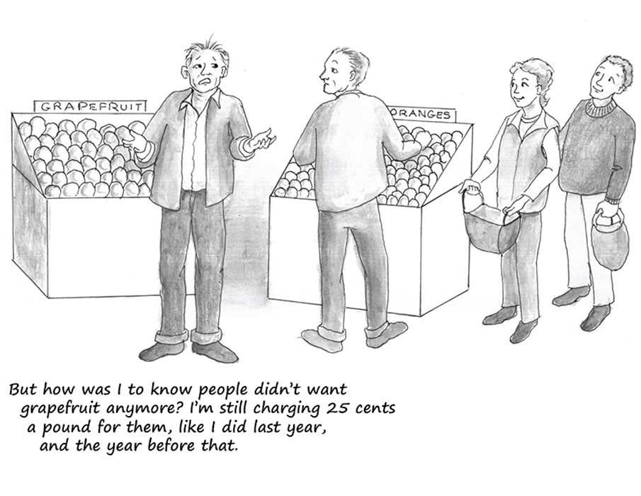

# 9. 第七章：经济繁荣和衰退

The Essential Hayek 翻译

## 第七章 Economic booms and busts 经济繁荣和衰退

 In fact ... the very measures which the dominant “macro-economic” theory has recommended as a remedy for unemployment, namely, the increase of aggregate demand, have become a cause of a very extensive misallocation of resources which is likely to make later large-scale unemployment inevitable. The continuous injection of additional amounts of money at points of the economic system where it creates a temporary demand which must cease when the increase of the quantity of money stops or slows down, together with the expectation of a continuing rise of prices, draws labour and other resources into employments which can last only so long as the increase of the quantity of money continues at the same rate — or perhaps even only so long as it continues to accelerate at a given rate.

Friedrich Hayek \(1974\). The Pretense of Knowledge. Lecture given in acceptance of the Nobel Prize for Economics. In Bruce Caldwell \(ed.\), Markets and Other Orders, XV \(Liberty Fund Library, 2014\): 367.

\*\*\*

事实上……主流宏观经济学理论推荐的通过提高总需求来减少失业的方法已经导致了资源的大规模错配，这很可能不可避免地导致之后更大规模的失业。通过向经济体不断注入额外货币创造的暂时性需求，使得人们预期价格会不断上涨，但这种现象是不可持续的，当货币注入停止或减慢时，临时性需求就消失了，而如果想维持被抽调来满足这些临时需求的劳动力和其他资源不失业，就必须不断以相同、甚至越来越快的速度向经济体注入货币。（《The Pretense of Knowledge》，哈耶克，1974）

### I. The role of “aggregate demand” “总需求”扮演的角色

Business people know that their profits rise and fall with rises and falls in the demand for the products they sell. If more paying customers are streaming through the doors, times are good. Fewer customers, in contrast, mean worsening times — and, for many firms, even bankruptcy.

商人知道他们的利润增减依赖于对他们产品的需求变化。如果更多的顾客排着队想来购买，好时光就来了，反之则是困难时期，期间很多公司甚至会倒闭。

Likewise for workers. They understand that the greater the demand for their employers’ outputs, the greater the demand for their labour services. When business is booming, their jobs are more secure and their wages rise. When business is bad, jobs are less secure and wages stagnate.

对工人来说情况类似。工人们明白如果他们为雇主生产的产品需求旺盛，对他们的劳力的需求也就会水涨船高。在生意兴隆的时候，工人的工作更加稳固，工资上涨；生意不行时，工作不稳，工资停滞。

This understanding by business people and workers of the importance of high demand in their industries and firms is correct. But as explained in the previous chapter, our roles as producers can mislead us into making mistaken conclusions about the larger economy. One such mistaken conclusion about the larger economy is that economic downturns — recessions — are caused by too little overall demand. A follow-up mistaken conclusion is that the appropriate cure for recessions is a set of government policies that increase demand.

商人和工人对需求重要性的理解是正确的。但就像上一章讨论的，我们作为生产者的身份可能会使我们在看待更大的经济体时得出错误的结论。认为经济下滑，即衰退，是因为总需求太小就是这样一个错误结论。紧随其后的错误结论是认为想恰当地战胜衰退，政府就得出台提升需求的政策。

Because an economy-wide recession affects nearly all firms and industries and not just a few, the demand that is said to be too low during recessions is called “aggregate demand.” Aggregate demand is the overall demand in an economy for all goods and services. The single most influential economics book written in the twentieth century is The General Theory of Employment, Interest, and Money , by the British economist John Maynard Keynes \(1883–1946\). Keynes reasoned that, just as high demand is key to the success of an individual firm, high aggregate demand is key to the success of a whole economy.

因为整个经济体的衰退几乎会波及所有公司和行业，所以这里所说的需求不足指的是“总需求”。总需求指的是经济体内对所有商品和服务的总的需求。20世纪最具影响的经济学书是英国经济学家凯恩斯\(1883–1946\)的《就业、利息和货币通论》。凯恩斯推断说，就像旺盛的需求是一个公司成功的关键，旺盛的总需求也是一个经济体成功的关键。

In Keynes’s view, economic recessions are caused by too little aggregate demand. The cure for recessions, therefore, is higher aggregate demand. And the best way to increase aggregate demand is for government to ramp up its spending until economic health is restored — that is, until full employment is reached.

在凯恩斯看来，经济衰退是因为总需求不足。因此克服衰退的办法就是提升总需求。提升总需求的最好办法则是政府增加消费，直到经济恢复健康，即达到完全就业。

This Keynesian view is widespread. It seems to make so much sense. But it suffers serious flaws. And perhaps its biggest flaw is its focus on aggregate demand.

凯恩斯的这套观点广为流传。它看着很有道理，但其实有着严重漏洞，最大的漏洞可能就是对总需求的关注。

By focusing on aggregate demand, Keynesian economics ignores the all-important \(“microeconomic”\) details of an economy. These vital details are how well or poorly each of the economy’s many individual parts “fit” together and work together to generate goods and services for consumers, and to create job opportunities for workers.

因为把注意力集中在总需求上，凯恩斯经济学忽略了重要的（微观经济学层面的）经济细节。这些重要的细节指的是经济体内众多单独的部分相互适应、合作的程度，它们相互合作来为消费者生产商品和服务，并为工人创造工作机会。

The desire of nearly everyone to possess and consume automobiles, along with lots of other goods and services, can be depended upon always to exist. The challenge is to ensure that producers have the knowledge and the incentives actually to produce the goods and services that people want. The challenge, in other words, is to get the economic details right so that producers have both the knowledge and the incentive to produce the “right” mix of outputs.

每个人几乎都有购买汽车与其他许多商品和服务的需求，这些需求几乎一直存在。难处在于怎么保证生产者有信息和激励去真的生产消费者需要的商品和服务，换句话说，就是怎么样把经济细节弄对好让生产者生产出“正确”的东西。

Relative prices are the main source of both this knowledge and these incentives. Relative prices are the prices of some goods and services relative to the prices of other goods and services. Examples are the price of a Toyota automobile relative to the prices of a Ford automobile and of a Honda auto mobile, or the price of a bushel of wheat relative to the prices of a bushel of rye and of a bushel of rice.

相对价格是这些信息和激励的主要来源，它指的是某些商品和服务相对其他商品和服务的价格。例如一辆丰田车相对于福特车和本田车的价格，或者一升小麦相对于一升黑麦和大米的价格。

Relative prices are the most important “directors” of economic activity. If the pattern of relative prices accurately reflects the many different demands of consumers as well as the costs of the inputs that can be used to satisfy these demands, then entrepreneurs, investors, and consumers will be led by these prices to act in ways that result in all of the economy’s “pieces” being fitted together into a productive whole. The economy at large will work pretty smoothly.

相对价格是经济活动最重要的“指导者”。如果相对价格能准确的体现消费者对不同产品的需求和生产这些产品所需的原材料的成本，那企业家、投资人和消费者会在相对价格的引导下相互合作成为一个富有生产力的经济整体。经济就会顺畅运转。

If, for example, consumers come to like oranges more than they had in the past, then the price of oranges will rise relative to the price of grapefruits. Farmers will soon produce more oranges and relatively fewer grapefruits. Or if supplies of iron ore fall, the price of steel will rise relative to the price of aluminum. Manufacturers will shift their production so that they use less steel and more aluminum to produce their products. If the price of gasoline rises, consumers will find ways to drive less, and they’ll also buy more fuel-efficient cars. If the wages of nurses rise relative to the wages of school teachers, more young people will study nursing and fewer will study education. If interest rates fall, businesses will increase their investments in activities such as factory expansion, worker training, and research and development.

例如要是消费者开始喜欢上橙子，那橙相对西柚的价格就会上升。农民很快就会生产更多的橙、更少的西柚。或者如果铁矿石的供应下降，钢相当于铝的价格就会上升。制造商就会用更多的铝、更少的钢进行生产。如果汽油价格上升，消费者就会想办法少开车，并最终会购买油耗更低的车。如果护士相对教师的工资上涨，年轻人就会更多的学习护士而不是教育专业。如果利率下降，商人就会增加投资活动，比如扩建工厂、训练工人、研发技术。 

Changes in prices relative to each other directs businesses to increase their outputs of goods and services that consumers now demand more intensely \(goods and services whose prices are rising\) and to decrease their outputs of things that consumers no longer want as intensely as they did in the past \(goods and services whose prices are falling\). Importantly, the pattern of relative prices also “tells” businesses and entrepreneurs how to produce their outputs at the lowest possible costs. For instance, if the price of natural gas falls relative to the price of electricity, some business owners who would otherwise have used electricity to heat their factories or office buildings will instead use natural gas.

相对价格的变化引导着商人多生产消费者更需要的东西（那些相对价格上涨的），少生产消费者不再那么需要的东西（相对价格下降的）。重要的是，相对价格也“告诉”商人和企业家怎么以最低的成本生产产品。假如天然气价格相对电下降了，一些商人就会用天然气而不是电力来为工厂或办公楼供热。

If the pattern of relative prices of consumer goods and services accurately reflects differences in the intensities of consumer demands for all of the different outputs produced in the economy — with prices rising for products in higher demand and falling for products in lower demand — producers will “know” what is the best mix of outputs to produce for sale to consumers. The pattern of prices tells them. And producers will have incentives to “listen” to these prices. The reason is that producers earn higher profits by expanding production of outputs whose prices are rising. Likewise, producers avoid losses by producing fewer of those outputs whose prices are falling.

如果所有消费品的相对价格准确地体现了消费者对商品的需求程度——需求增加价格就上升，反之亦然，那生产者就可以“知道”什么样的生产组合是最适合销售的。这是价格分布告诉他们的。而且生产者也有动机去“倾听”价格，因为他们可以通过多生产价格上升的产品获利，少生产价格下降的产品而避免损失。

Getting all of these details of pricing right is key to economic health.

让价格的这些细节全部准确对经济健康至关重要。

In a competitive market economy based on private-property rights, people tend to make correct decisions. Not always, of course. But by and large the economic decisions people make in markets are sensible ones. The reason is that each individual personally gains by making wise choices about how to use his resources, and personally loses by making poor choices. Our trust in the overall “correctness” of people’s economic decisions, however, requires that the prices that people use to guide their decision-making are reasonably accurate sources of information. There’s trouble if prices do not reflect realities. If consumers come to demand more oranges and fewer grapefruits, but the price of oranges doesn’t rise relative to the price of grapefruit, citrus growers won’t “know” to produce more oranges and fewer grapefruit. Too many workers and resources will be used to grow grapefruit; too few workers and resources will be used to grow oranges. These workers and resources will be malinvested — that is, these workers and resources will be invested in production processes that do not best meet the demands of consumers.

在一个基于私有产权的竞争性市场经济里，人们倾向于做出正确的决策。当然并不总是如此，但市场上人们做出的决策大部分都是明智的。因为当个体正确地使用他的资源时，他获得奖励，反之则蒙受损失。这种个体经济决策加总后的集体智慧的“正确性”却有个前提，那就是人们赖以作出决策的价格信号是足够准确的信息来源。假如价格没能反映现实，那麻烦就来了。如果消费者想要更多的橙、更少的西柚，橙相对西柚的价格却没有上涨，果农们就不会“知道”该去生产更多的橙和更少的西柚。过多的工人和资源会被用于种植西柚，而种植橙的工人和资源则太少。这些工人和资源就被错误地投资了，即他们未能被投入到能最好地满足消费者的生产过程中去。

Likewise, if supplies of steel fall while supplies of aluminum rise, but the price of steel doesn’t increase relative to the price of aluminum, producers will not “know” to use less steel and more aluminum in their production plans. Shortages of steel will eventually arise, disrupting the production of goods that are made with metal.

类似的，如果钢铁供应下降而铝的供应上升，但钢铁相对铝的价格却没有上涨，生产者就无法“知道”该在生产计划里多用点铝、少用点钢。钢铁的短缺终将显现，并扰乱那些需要金属的商品的生产。

If prices in only a handful of markets fail to accurately reflect underlying economic realities \(such as the intensity of consumer demand for oranges relative to the demand for grapefruit\), the economy won’t suffer greatly. But when prices in general are out of whack — when prices in most markets send out mis information — widespread economic troubles arise. Entrepreneurs and investors throughout the economy will then act on false information about what consumers want and about what inputs make possible the lowest-cost ways to satisfy those wants.

如果价格信号只是在个别行业未能反映现实（比如未能反映消费者对橙和西柚的相对需求），那对经济的损害不会太大。但如果价格信号整体性地出错，也就是在大多数行业价格反映的信息都是错的，那大规模的经济问题就会产生。经济体内的企业家和投资者都会利用错误的信息去理解消费者的需求和哪些原材料可以以最低的成本满足这些需求。

With such widespread failure of prices to coordinate the plans of producers with the plans of consumers, economic activity stagnates. Some producers discover that they can’t sell all of the output that they have produced. Other producers find themselves unable to get all of the inputs necessary to carry through with their production plans. Yet other producers learn that, had they produced more output, they could have sold more output.

当价格信号在指导生产上这样大规模地失败，经济就会陷入停滞。一些生产商会发现他们无法卖出所有产品，另一些发现他们无法获取足够的原材料完成生产计划，还会有些生产者会发现他们本来可以生产、销售掉更多的产品。

If prices are free to adjust in response to these discoveries of errors, they will eventually do so. The pattern of prices will then give entrepreneurs and investors more accurate direction about what to produce and how best to produce those goods and services. Such adjustments in production activities, however, are not instantaneous. They take time. Orchards planted with grapefruit trees cannot immediately be transformed into orchards planted with orange trees. Redesigning an automobile body or the casing of MP3 players to be made with more aluminum and less steel can’t be done with the snap of a plant-manager’s fingers.

如果价格能随着这些错误的发现而自由变化，那价格最终就会回归正常。那时价格就能给企业家和投资者更准确的信息，告诉他们该生产什么以及如何最好地生产。但这种变化需要时间，并不能马上完成。种着西柚的果园无法一下就种满橙树。重新设计使用更多铝、更少钢的车身或者MP3外壳也不是生产线经理打个响指就能完成的。

Unemployment rises during the time it takes for these adjustments to be made. Workers in industries with unsold inventories are laid off, and time is required for them to find employment elsewhere. Even industries that expand in response to more accurate prices typically require some time to rearrange their production plans and facilities in order to make profitable the hiring of new workers.

在这段调整期内，失业率会上升。那些存货积压的行业的工人会被裁员，他们需要时间才能在其他地方找到新工作。即使那些在更准确的价格信号下将会扩张的行业也需要一些时间来重新安排生产计划和设备好让雇佣新工人有利可图。

The time it takes for the firms to adjust away from the production plans they made when prices were inaccurate is time during which unusually large numbers of workers are unemployed.

这段公司调整生产计划的时间往往伴随着不寻常的大规模失业。

Such unemployment is not caused by too little aggregate demand.

这种失业不是因为总需求不足引起的。

Therefore, such unemployment cannot be cured by more government spending or other efforts to raise aggregate demand. Instead, such unemployment is caused by the widespread failure of individual prices to convey accurate information to entrepreneurs and investors about what specific products they should produce and about how best to produce these products. The only way to cure this malinvestment is to allow prices to adjust so that they better reflect consumer desires and the realities of resource availabilities. This cure, again, requires time — time for prices to adjust and for workers to find and move to jobs that are more economically sustainable.

因此增加政府支出或者其他提升总需求的做法都无法真正解决这种失业。这种失业是由价格信号的大规模失效引起的，价格未能向企业家和生产者传递关于生产什么和如何最优生产的信息。所以唯一解决这种错误投资的办法就是允许价格自我调节，以反映出消费者需求的变化和资源可得性的真实情况。这种解决办法还是需要时间，需要时间让价格去调节、让工人转移到经济上更可持续的行业去。

### II. The effects of poor monetary policy 糟糕的货币政策的后果

What might cause such a widespread failure of prices to convey reasonably accurate information? The most likely culprit in reality is poor monetary policy. If the money supply is stable — that is, if the money supply is not expanding or shrinking arbitrarily — the pattern of prices is likely to be mostly correct. There’s no good reason to suppose that in an economy in which markets are reasonably competitive and well-working that, suddenly, prices generally will become so out of whack that significant amounts of labour and resources are drawn into industries where they don’t belong. But if the money supply itself is changed, the pattern of prices might well become grossly distorted.

什么事情可能导致价格信号的这种普遍失灵呢？现实中最可能的嫌犯是糟糕的货币政策。如果货币供应稳定，即货币供应没有任意地扩张或紧缩，价格一般就会大致准确。我们并没有什么好的理由认为在一个市场足够竞争并运转良好的经济体内，价格会突然整体性地出错，导致劳力和资源显著地错配。但要是货币供应改变了，价格可能就会被整体性地扭曲。

If the monetary authority \(in most countries, a central bank with the power and authority to raise of lower the supply of money\) injects streams of new money into the economy, significant distortions can occur. The reason is that new money enters the economy in particular places — specifically, through commercial banks making loans. This new money then spreads out to the rest of the economy from those places of entry. The people who are the first to get the newly created money spend it on particular goods and services. To make the explanation smoother, let’s assume that the new money is spent first on purchases of new automobiles \(by bank customers who use their borrowed money to finance such purchases\).

如果货币当局（在多数国家，就是央行，他们有权调节货币供应）不断向经济注入货币，价格就会被严重地扭曲。因为新货币是从经济体的特定部位注入的，具体来说就是商业银行的贷款。这些新货币再从银行贷款扩散到经济的其它部分。最先得到新货币的人会把钱花在某些商品和服务上。为了让讨论更简单，我们假设这些新货币首先通过那些贷款买车的人被花在购买新车上。

The injection into the economy of streams of newly created money will thus cause the price of automobiles to rise relative to the prices of all other goods and services. These higher automobile prices tell an economic lie to people throughout the economy. Entrepreneurs and investors, seeing automobile prices rise relative to the prices of motorcycles, air travel, jeans, bread, and every other good and service, are misled into the false conclusion that there is a genuine increase in the demand for automobiles relative to the demands for other goods and services.

因此新货币的注入会导致汽车价格相对其他商品上涨。上涨的价格会在经济上欺骗所有人。企业家和投资者看到汽车价格相对摩托车、航空运输、牛仔裤、面包和其他所有商品的价格上涨了，就会误以为人们对汽车的需求真的增大了。

In fact, however, the higher prices of automobiles reflect only the fact that automobile buyers include lots of people who are lucky enough to be the first to spend the newly created money. This additional demand for automobiles isn’t “real.” This additional demand doesn’t reflect people producing more output in order to earn more income to spend on new cars. Nor does this additional demand for automobiles come from these people decreasing their purchases in other markets in order to increase their purchases of automobiles.

但其实汽车价格的上升仅仅反映了购买汽车的人里有许多是最先接手新货币的幸运儿。对汽车需求的增加并不是“真实”的，它并不意味着人们在努力生产以多赚钱来买新车，也不意味着人们在削减其他方面的开销来多买车。

In short, this higher demand for automobiles reflects only the fact that new money was created and spent, as it entered the economy, first on automobiles.

简单来说，对汽车的更多需求只是反映了新货币在进入经济体后，被创造并首先花在了汽车上。

Once the stream of new money entering the economy stops flowing and these people no longer have this newly created money to spend, they will resume spending as they did before they got the new money. Demand for automobiles will fall back to its previous level \(that is, demand for automobiles will fall to its level before being artificially driven up by the spending of the new money\). But if enough new money is created and continually injected into the economy for a long-enough period of time, the prices of automobiles will rise by enough — and stay artificially high for long enough — to cause entrepreneurs and investors to shift some resources out of other industries and into automobile production.

一旦不再有新货币注入，购车者也就不再享有多出来的新货币，他们的行为就会变回从前。对汽车的需求也会下降回原来未被新货币人为提高的水平。但是如果足够的新货币在足够长的时间内源源不断地注入经济中，汽车的价格就会在高位维持任意长的时间，从而让企业家和投资者把资源从其它行业转移到汽车生产上来。

Automobile producers will be the next in line to spend the newly created money. If automobile producers spend all of the additional money they get on, say, clothing, the prices of clothing will be the next to rise. Clothing sellers will, in turn, spend the new money that they get in some particular ways — say, on children’s toys and kitchen appliances. The prices of children’s toys and kitchen appliances will then rise.

汽车生产商会是下一个花掉新货币的人，假如他们把新货币都花在衣服上，那衣服的价格就是下一个上涨的。下一步，衣服销售商又会把新货币花在某些地方，比如儿童玩具或厨具上。那儿童玩具和厨具的价格又会上涨。

Eventually, the newly created money works its way throughout the whole economy. This new money is ultimately spread out evenly across all markets. The final result is that the overall price level — that is, the average of all prices — is higher, but all individual prices relative to each other are unchanged from what they were before the new money was injected into the economy. For example, if as a result of the injection of new money the price of automobiles rises from $20,000 to $30,000 and the price of motorcycles rises from $10,000 to $15,000, the attractiveness to producers of producing automobiles relative to the attractiveness of producing motorcycles is unchanged: cars still fetch twice the price of motorcycles.

新货币最终流过整个经济体，均匀地分布于所有行业。结果就是总物价水平——所有价格的平均，上升了，但商品之间的相对价格与新货币注入前则不会有变化。举例来说，如果由于新货币的注入汽车的价格从$20000涨到了$30000，摩托车价格从$10000涨到了$15000，那对生产者来说，生产汽车相对生产摩托车的吸引力并没有变，因为汽车价格依然是摩托车的两倍。

### III. Where interest rates fit in 利率起作用的地方

What’s true for distortions in the relative prices of consumer goods \(such as automobiles and motorcycles\) is true also for distortions in the prices of consumer goods relative to the prices of capital goods \(such as bulldozers and skyscrapers\). Indeed, Hayek argued that distortions in the prices of capital goods in relation to consumer goods are the chief source of booms and busts. The reason has to do with the central role of one particular set of prices: interest rates.

消费品之间（例如汽车和摩托车）相对价格扭曲的故事也适用于消费品和资本品之间（例如推土机和摩天大楼）的相对价格扭曲。实际上哈耶克争辩说后者正是经济周期的主要原因。理由在于有个特殊的价格在经济中处于中心地位，那就是利率。

Interest rates reflect people’s “time preference” — that is, their preference for consuming today rather than delaying consumption until tomorrow. The lower is people’s time preference, the more willing they are to delay consumption. And the more willing people are to delay consumption, the more they save. More savings, in turn, mean lower interest rates. \(Banks have more money on hand to lend.\) The lower are interest rates, the more attractive are long-term investments.

利率反映了人们的“时间偏好”，即人们对于今天消费还是明天消费的偏好。时间偏好越低，人们越乐意推迟消费。越推迟消费，储蓄就越多。更多的储蓄又会降低利率（当银行有更多钱，它们就会更愿意放贷）。低利率则会让长期投资变得更有吸引力。

For example, a transcontinental railroad that takes ten years to build is a more attractive investment for the potential builder if the interest rate is 3 percent than if it’s 10 percent. That’s because the amount of interest that must be repaid when the railroad finally starts to operate and generate revenue will be much lower if the railroad builder borrows funds at an interest rate of 3 percent than at a rate of 10 percent. So although this railroad might not be profitable to build at the higher interest rate, it will perhaps be profitable to build at the lower interest rate.

举个例子，与利率为10%相比，利率为3%时，花十年修建一条横贯大陆的铁路对潜在建设者会更有吸引力。因为在铁路最终开通时，建设者为了修铁路借来的贷款需要偿还的利息在3%利率下会比10%利率下少得多。所以即使铁路在10%利率时修建不划算，在更低的利率下就有可能盈利。

Low interest rates signal to entrepreneurs that people in general are very willing to forego consuming today so that resources can be used to produce, not MP3 players, hot tubs, and other consumer goods today, but instead steel rails, locomotives, bulldozers, and other capital goods.

低利率告诉企业家人们很愿意放弃眼前的消费，所以资源可以被用于铁轨、火车头、推土机和其他资本品，而不是MP3播放器、浴缸和短期消费品。

But what if people really don’t want to delay their consumption for very long? What if interest rates “lie” — telling entrepreneurs that people are saving more than they really are saving? Hayek argued that such a lie plays an especially critical role in business cycles. When the money supply is increased, the new money typically enters the economy through banks — and to loan this new money, banks lower the rates of interest they charge borrowers. In Hayek’s view, the prices that are most dangerously distorted by expansions of the money supply are interest rates. The artificially low interest rates prompt entrepreneurs and businesses to borrow too much — that is, to borrow more than people are really saving. Artificially low interest rates lead producers to undertake more time-consuming — “longer” — production projects than they would undertake at higher rates of interest.

但要是其实人们并不是真想推迟消费呢？如果利率“撒谎”了，传达给企业家的人们的储蓄意愿高于真实意愿呢？哈耶克论证说这个谎言在经济周期中起着重要作用。当货币供应增加，新货币往往通过银行进入经济体，而为了借出这些新货币，银行就会降低利率。在哈耶克看来，货币扩张带来的最危险的扭曲就是利率的扭曲。人为的低利率使得企业家和商人过多借贷，也就是借的超过人们真正存的。人为的低利率让生产者选择更多的长期生产项目。

Unfortunately, interest rates are lower not because people are saving more but only because the creation of new money pushed these rates lower. In this case, plans to build long-run projects — such as, again, a railroad that takes ten years to complete — will eventually run into trouble. With people saving too little to allow all of the necessary steel rails, workers’ barracks, and other capital goods to be produced, the railroad builder in time finds that he cannot complete his project profitably. He must lay off his workers.

不幸的是，低利率并不是因为人们在更多地储蓄，而仅仅是被新创造的货币压低了。这样一来，那些长期生产项目，比如需要建造十年的铁路，最终会陷入麻烦。当人们的储蓄不足以生产所有铁轨、工人营房和其他需要的资本品时，铁路建设商就会发现这个项目无利可图，他不得不裁掉他的工人。

As time passes and the investments in excessively “long” business projects are finally entirely liquidated, laid-off workers find other jobs. This result, however, occurs only in the long run. Much economic trouble arises during the short run \(which can be a long time when measured on a calendar\). Once again, before all of the newly created money finally \(“in the long-run”\) is spread evenly throughout the economy, the pattern of relative prices is distorted by the stream of new money injected into the economy. During the time it takes for the newly created money to work its way from the markets where it is first spent into each of the economy’s many other markets, the distorted relative prices — including artificially low interest rates — mislead people into making economic decisions that are inconsistent with the true patterns of consumer demands and resource supplies.

随着时间流逝，在这些超“长期”项目上的投资最终清偿，被裁的工人也找到了新工作。但这只是长期结果，短期内则会产生大量的经济问题（这个“短期”完全可以很长）。又一次，在所有新货币最终（“长期来看”）均匀地分布到经济体内之前，相对价格都会被新货币扭曲。在新货币从最初的地方流动到市场的其他部门时，扭曲的相对价格，包括人为的低利率，误导着人们做出与真实的消费者需求和资源供应不相符的经济决策。

It is regrettable that the process of unwinding unsustainable investments takes time. But lasting economic health requires that such unwinding occurs. Unfortunately, during the time required to unwind the unsustainable investments there is indeed a great deal of economic suffering. And, understandably, there are many appeals to political authorities to ease the suffering. As we’ll see in the next chapter, political authorities too often respond to these appeals with policies that only mask and worsen the problem.

很遗憾消除不可持续的投资需要时间，但经济的持久健康需要这种消除。不幸的是，在这段时间内，经济会承受极大的痛苦。而且，可以理解地，政客们会面临大量要求缓解痛苦的恳请。下一章中我们会看到政客对这些恳请的应对只会掩盖和恶化问题。

