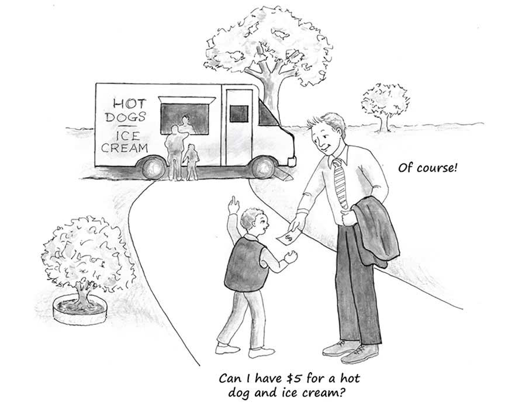
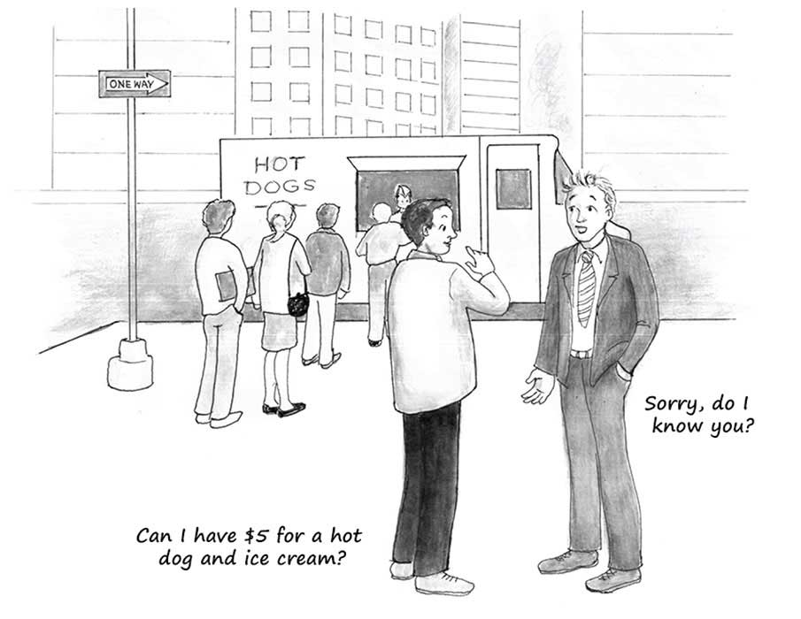

# 11. 第九章：在现代社会成功生活的挑战

The Essential Hayek 翻译

## 第九章 The challenge of living successfully in modern society 在现代社会成功生活的挑战

 Part of our present difficulty is that we must constantly adjust our lives, our thoughts and our emotions, in order to live simultaneously within the different kinds of orders according to different rules. If we were to apply the unmodified, uncurbed, rules of the micro-cosmos \(i.e., of the small band or troop, or of, say, our families\) to the macro-cosmos \(our wider civilization\), as our instincts and sentimental yearnings often make us wish to do, we would destroy it. Yet if we were always to apply the rules of the extended order to our more intimate groupings, we would crush them. So we must learn to live in two sorts of worlds at once.

Friedrich Hayek \(1988\). The Fatal Conceit. In W.W. Bartley III \(ed.\), The Fatal Conceit, I \(Liberty Fund Library, 1988\): 18.

\*\*\*

我们现在的一部分困难在于,为了能够遵守不同的规则,同时生活在不同类型的秩序中,我们必须不断地调整我们的生活、 我们的思想和我们的感情。我们的本能和情感欲望经常渴望不加修正和限制地把小世界\(例如小部落或小群体或我们家庭\)中的那种规则用于大社会\(如我们更为广阔的文明\)，但那样我们就会毁了大社会。但是假如我们总是把扩展秩序中的规则用于我们较为亲密的群体，我们也会摧毁小群体。因此，我们必须学会同时在两个世界里生活。（《致命的自负》，第一章，哈耶克）

As emphasized throughout this volume, modern prosperity is produced through an astonishingly complex web of human cooperation. This web of cooperation is vast. It spans the globe. Nearly every individual in the modern world is part of it, both as a consumer and as a producer. And so almost all of this productive cooperation is among strangers.

如本书通篇强调的，现代社会的繁荣是通过惊人复杂的人类合作网络实现的。这张网络非常巨大，延伸全球。几乎每一个生活于现代世界的人都同时以生产者和消费者的身份生活于这张网络之中。而且几乎所有生产性的合作都是在陌生人之间发生的。

This fact is highly significant for the rules that guide us in our daily activities.

这一事实对指导我们日常活动的规则非常重要。

Every day, each of us participates in two very different kinds of productive and valuable social arrangements. One of these arrangements involves interactions with people who we know and care about — our parents, siblings, spouses, children, friends, close neighbours. Call these arrangements “small-group arrangements.”

每天我们都要参与两种非常不同，但都高效、有价值的社会组织形式中去。一种组织形式包括了我们和那些我们熟知并在意的人，例如父母、兄弟、配偶、孩子、朋友和近邻之间的互动。让我们把它叫做“小群体形式”。

The other arrangements are with multitudes of strangers — the millions of people in the great global web of economic cooperation. A small handful of these strangers you see face-to-face, such as the cashier at the supermarket and the flight attendants on your most recent flight. But the bulk of these strangers — such as the person who sewed the shirt you’re now wearing, and the person who designed the shoes now on your feet — are people you’ll never lay eyes on. All of these strangers are people you know nothing about. Call arrangements with these multitudes of strangers “large-group arrangements.”

另一种组织形式涉及和全球经济合作网中成千上万的陌生人打交道。其中一小部分陌生人你会面对面的遇到，比如超市的收银员和航班上的空乘。但是大部分陌生人，比如缝制了你身上衬衫的人、设计了你脚上鞋的人，你永远都不会见到他们。你对这些人一无所知。让我们把这种涉及大量陌生人的组织形式叫做“大群体形式”。

One of the greatest challenges to those of us who live in modern society is to be able to function comfortably within both types of arrangements. The challenge lies in the fact that behaviours that are appropriate in one of these arrangements are often inappropriate in the other, and vice-versa.

在现代社会生活的最大挑战之一就是如何在两种组织形式内都能舒适地行动。难处在于在一个组织形式里合适的行为在另一个里常常变得不合适。

Consider the ultimate small-group arrangement: the immediate family. As in the larger society, within families economic decisions must be made. What’s on the menu for tonight’s dinner? Who’ll cook that dinner and who’ll wash the dishes? \(Such decisions allocate the family’s labour resources.\) Where will the family vacation this summer? Should money be spent to remodel the kitchen or should that money be saved for the kids’ college education?

考虑小群体组织的终极版本：直系亲属组成的家庭。就像大社会一样，小家庭里也需要做些经济决策，例如晚餐吃什么，谁做饭谁洗碗（这些决策分配了家里的劳动力资源），这个夏天去哪度假，钱应该用来重新设计厨房还是为孩子的大学教育储蓄。

Within families, even such “economic” decisions are not made commercially among the members of the family. Perhaps family decisions are made by mutual agreement; perhaps mom and dad alone make all decisions. But regardless of the details of the rules or habits that any particular family uses to reach decisions, normal families do not make decisions by using “arms-length” formal contracting, market prices, competitive bidding, or any of the other impersonal procedures that characterize most of our economic relationships with strangers.

在小家庭内，即使这些“经济”决策也不是家庭成员商业性地决定的。它们可能是家庭成员相互同意决定的，也可能是父母做出所有决策。但不管决策过程细节如何，普通家庭的决策都不会是通过公平对等的正式合同、市场价格、竞拍或者任何其他冷冰冰的程序做出的，这些东西是我们和陌生人之间的经济关系才有的特征。

The same holds true for decision-making within other small-group settings, such as when friends decide which movie to watch together. The decision is typically reached by informal discussion leading to mutual consent, rather than through bargaining in which the highest monetary bidder gets to choose.

其他小群体里的决策程序也是类似的，例如当朋友之间要决定去看哪部电影时，一般是通过非正式的讨论来达成共识的，而不是让出价高者进行选择。

Also within families and many small groups we typically apply egalitarian norms of distribution. The portion of the family’s budget that mom has, the portion that dad has, and the portion that each of the kids has is not determined by impersonal market forces. It is instead determined by a strong sharing norm. Within families, income is distributed not only consciously \(usually by the heads of the household\) but also more or less equally. This sharing norm within families and most other small groups is, of course, praiseworthy.

在家庭等小群体内我们也往往进行平等的分配。家庭预算里妈妈有多少、爸爸有多少、每个孩子有多少都不是通过非人格化的市场力量决定的，而是通过一种强烈的分享原则决定的。收入在家庭内部不仅仅是人为地分配（一般是由一家之主决定），而且多多少少也是平均分配。这种家庭和其他小群体内的分享原则当然值得称赞。

That we use informal, non-commercial decision-making procedures and norms in small-group settings is a good thing. First, the formalities and competitiveness of commercial procedures are unnecessary in small-group settings. Family members and friends genuinely care about each other and they know each other personally and with a depth of detail that simply cannot exist among strangers. So not only can people in small-group settings rely upon love or mutual concern to prevent cheating; people in these settings also know a great deal about each other. This mutual, detailed, and deep knowledge enables each person to be trusted to act wisely with respect to each other. Parents, for example, generally do not need to be forced by the police to treat their children well. Also, as parents they know their children’s desires and abilities well enough that they do not need to learn this information through market competition and prices.

在小群体内我们用非正式、非商业的程序和原则做出决策，这是件好事。首先，商业程序的正式感和竞争性对小群体来说没有必要。家庭成员和朋友之间是真心在乎彼此的，而且大家对彼此的个性都有深入了解，这在陌生人之间是不可能的。所以小群体环境内人们可以依靠相互关爱来防止欺骗，人们对彼此也非常了解。这种相互深入详尽的了解让大家都信任对方会以明智、尊重的方式行动。例如家长一般并不需要警察强迫才会善待孩子。而且家长也不需要通过市场竞争和价格来了解他们孩子的需求和能力，因为他们已经足够了解了。

The close personal connections, the on-going face-to-face communications, and the mutual affections that bind together members of families and other small groups give each member of these small groups such deep knowledge of the other members that no impersonal means of dealing with each other are required.

个体间亲密的关系、持续不断的面对面交流、把小群体成员凝聚起来的相互关爱都让小群体里人人都对其他人有着深入了解，这样就没必要用非人格化的方式打交道。

Second and more importantly, using the formalities and competitiveness of commercial procedures in small-group settings would undermine all that is valuable about those settings. Central to our human nature is our longing and our ability to interact with loved ones and with friends on personal terms — to interact in ways that are built upon particular feelings and expressions of sentiment, caring, and love. Each of us wants to have people to personally care for and to care about, and each of us wants to be loved and cared for personally by other flesh-and-blood individuals. Attempts by parents, say, to charge their children for home-cooked meals, for the time that parents spend nursing their children through illnesses, or for any other benefits and care-giving that parents extend to children would rip from family interactions all that makes those interactions worthwhile and satisfying. Children growing up in such “families” would likely become, at best, social misfits as adults.

其次，更重要的是把商业程序那种正式感和竞争性带入小群体会破坏我们珍视的东西。人性的核心是我们想和朋友及所爱之人进行个体交流的渴望和能力，这种交流依赖于对情绪、关心和爱的特殊感受和表达。我们每个人都希望有我们关心的人，也都希望被其他有血有肉的人关心和爱。父母会为子女做饭、生病时加以照顾、还有许多许多关心和爱护，假如父母对这些事情收费，那就剥夺了这些家人间互动的价值和满足感。在这样“家庭”长大的孩子成年后在最好的情况下可能也无法适应社会。

With the exception of giving young children an allowance as a way to help them begin to understand how to manage money, the money nexus has little or no place within a healthy family unit. A household run like a business would crush rather than nurture those familial bonds and personal sentiments that are so deeply important to us as human beings. In a world run only by arms-length contracting, market competition, money prices, and the formal “thou-shalt-not” rules that we follow when dealing with strangers, intimate relationships, loving families, and close friendships would not exist. Such a world would be worse than cold; it would be inhuman.

除了给孩子一些零花钱好让他们开始理解怎么理财，金钱关系一般在一个健康的家庭里没什么位置。像经商那样经营家庭会摧毁而不是滋养那些在我们内心深处极度重要的家庭纽带和个人情感。假如世界上只有和陌生人交往时需要遵守的公平对等的正式合同、市场竞争、货币价格和各种正式的“你不该这样”的规则，那亲密关系、充满爱的家庭和亲密友谊都不会存在。这样一个世界比冰冷还要糟糕，它是非人性的。

Everyone understands the value of personal relationships governed by love and sentiment. Not only are such relationships part of everyone’s daily lives, we as a species are also evolved to treasure such relationships and to know how to engage in them. Again, parents naturally care for their children; they do not have to be instructed to do so or about how to do so. Likewise, because we humans spent most of our evolutionary history living in small bands of individuals who were known face-to-face to each other — and interacting only relatively rarely with strangers — nearly all of our successful personal connections continue to be with the individuals in our small groups.

人人都理解由爱和感情主导的私人关系的价值。这些关系不仅仅是每个人日常生活的一部分，我们这个物种也已经通过进化懂得了珍视和如何参与这些关系。父母自然就会关爱子女，无需有人指导他们这样做和如何做。类似的，因为人类在进化史上的大部分时间里都生活在相互认识的小群体中，很少和陌生人打交道，所以几乎所有成功的私人关系依然都限于小群体内。

The sentiments and emotions that bound members of small groups together and best enabled them to survive and to reproduce became encoded in our genes. These sentiments and emotions, therefore, are inextricably part of who we are. They are part of what it means to be human. And although human society in modern times has grown in size far larger than the small groups in which most of our ancestors lived, these small-group sentiments and emotions remain important “guides” to us in our dealings with our loved ones and friends.

那些让小群体成员凝聚起来、成功生存和繁衍的情感于是被写入我们的基因。这些情绪和感情因此变成了我们不可分割的一部分。他们是人之异于禽兽的一部分。而且虽然现代社会的规模已经远远大于我们祖先生活的小群体，这些小群体内的情感依然保留了下来，“指导”着我们如何与朋友和所爱之人相处。

As valuable and agreeable as these small-group sentiments and emotions are, however, they are poorly suited to guide us in our connections with the larger society. We cannot possibly know enough about strangers to be able to interact in their lives as intimately as we interact in the lives of people whom we know personally. Also, we cannot possibly care as deeply about the well-being of strangers as we care about the well-being of our family and friends.

虽然这些小群体内的情感令人愉悦、很有价值，但它们难以指导我们在大型社会与人相处。对陌生人我们不可能有对小群体成员那么多的私人了解，所以也不能采用类似的方法去打交道。我们也不可能像关心家人朋友那样深入地关心陌生人的幸福。

And yet, to flourish in modern society requires our almost-constant interaction with countless strangers. To be productive for everyone involved, these interactions must be based on mutual consent and governed by an ethic of kept promises. But these interactions need not be based on feelings of love, caring, and concern. This fact is fortunate because, as just noted, no one is capable of knowing about and caring about more than a tiny number of the individuals with whom he or she interacts daily.

而且，想在现代社会过得好就得几乎不断地与无数陌生人相互作用。如果要让每个参与者都能高效，这些相互作用就必须建立于由信守承诺的道德观约束的相互同意。但这些相互作用无需基于爱、照顾和关心。这非常幸运，因为如之前所说，人们只有能力了解和关心日常生活中打交道的一小部分人。

Being guided in our interactions with millions of strangers by impersonal rules and market forces, our capacity for love and concern for others isn’t over-taxed. Nor are we called upon to learn the details of the lives of these strangers. When you want to buy, say, a new car, you need to know only some information about the quality of the car and its price in comparison with other cars. The only personal information you need to know when deciding whether or not to buy the car is information about yourself. What are your tastes and preferences in automobiles? What is your price range? What financial arrangements to pay for a car work best for you? You do not have to know — and you cannot possibly know — any such personal information about the millions of individuals whose efforts contributed to the production of the car.

非人格化的规则和市场的力量指导着我们与无数陌生人的交往，这使得我们向他人提供关爱的能力不会过载，我们也不需要去了解这些陌生人的生活细节。例如当你想要买辆新车时，你只需知道这车的质量和价格与其他车相比怎么样。买车时你唯一需要了解的个体是你自己：你喜欢什么样的车，你能接受的价格范围，什么样的支付安排最适合你。你不需要了解、也不可能了解生产这辆车所涉及的成千上万人的个人信息。

The rules for interacting with strangers overlap with, but are much “thinner” than, the rules for interacting with people whom we know personally. Treat strangers with respect and do not presume that you are a better judge than they are of what is best for them; do not steal from strangers; do not cheat them; initiate no violence against them; keep your promises to them; respect their property rights. To follow these rules requires no personal knowledge of strangers. When people follow these impersonal rules when dealing with strangers in the economy, “arms-length” exchange and contracting occur. These exchanges and contracts give rise to market prices. These prices, in turn, guide each of us to interact productively — as both consumers and as producers — with the increasingly large numbers of strangers who make our modern lives possible.

与陌生人打交道的规则和与熟人打交道的规则有重合，但内容少得多。对待陌生人我们只需要尊重他们、不要觉得自己比他们更有资格评判他们的生活、不要偷他们的东西、不要欺骗他们、不要首先对他们使用暴力、信守对他们的承诺、尊重他们的产权。遵守这些规则无需任何陌生人的个体信息。当人们在经济中以这些规则与陌生人打交道时，公平对等的交易和契约就会出现。这些交易和契约产生了市场价格。价格又接着指导人们以消费者和生产者的身份高效地与越来越多的陌生人互动，这最终使得现代社会成为可能。

The success and sustainability of modern society, therefore, requires that each of us be guided by our small-group norms when interacting with people we know personally, yet also to put those norms aside when interacting with strangers.

因此现代社会的成功和持续有赖于我们每个人在和熟人互动时遵守小群体规范，同时在与陌生人打交道时把小群体规范放到一边。

Switching back and forth between these two sets of very different norms is difficult, especially because we are genetically hard-wired to follow small-group norms. When we see on television or in Internet clips the faces of strangers who are suffering job losses or some other economic misfortune, our small-group norms trigger within us sympathies for these strangers \(especially if they share our political nationality\). So when government officials promise to “do something” to relieve the suffering, we are inclined to support those efforts, even if we suspect that those efforts will cost us something. Intellectual reasoning might convince us that the government’s proposed efforts won’t work, are too costly, or are otherwise unjustified. But insofar as we think of our nation as our extended family, the planned efforts of the government tap into our small-group norms. These norms, thus activated, are often difficult to overcome by those who wish to make unbiased \(“rational”\) evaluations of government policies. For better or worse, even the best rational evaluation is often inadequate to overcome the emotional impulse to consciously tend to those among us who we perceive as suffering.

在两套行为规则间来回切换是挺困难的，尤其我们的基因里就编码着小群体的规范。当我们在电视或网上看到那些由于失业或经济上的不幸而受苦的陌生人的脸，我们心里的小群体规范就会触发，使我们对这些陌生人产生同情（尤其如果他们还跟我们同属一国）。所以当政府官员承诺“做些什么”以减少他们的痛苦时，即使我们怀疑这会让我们负担些成本，我们也倾向于支持。理性上的思考可能可以说服我们政府的提议不会有效、太过昂贵或者在其他方面不合理。但如果我们把国家想象成我们扩展的家庭，政府的这些提案就会唤醒我们心里的小群体规范。而这些规范一旦激活，就很难被对政府政策做无偏见（“理性”）评估的愿望盖过。不论好坏，即使最好的理性评估也常常不足以战胜那种有意偏向我们认为在受苦的同胞的情感冲动。  

The power of these small-group norms is especially intense when government presents itself — and is portrayed by the media, by academics, and by popular culture — as being the caring and wise leader of our national “family.” In the same way that we would make personal sacrifices to save our children or siblings from economic hardship, “we” as members of the national family, applaud efforts by the leaders of our national family to rescue those among us who have fallen on hard times.

当政府自称，而且也被媒体、学术界和流行文化描绘为国家这个“大家庭”明智又有同情心的领导者时，这种小群体规范的力量就尤其强大。就像我们会做出自我牺牲去帮助孩子或兄弟的经济困难，“我们”作为国家大家庭的一份子，也会为国家领导者帮助那些处于困境的同胞而喝彩。

But government policies springing from these small-group norms can be counterproductive. If, for example, government raises tariffs to protect the jobs of domestic wheat farmers, workers in other industries suffer. The reason is that higher tariffs on wheat — by reducing the number of dollars that foreigners earn by selling wheat to us — mean that foreigners will have fewer dollars to use to buy other goods from us \(or to invest in our economy\). But because these negative effects of the tariff are spread over a large and very diverse number of people, they are more difficult to see than are the benefits of the tariff, which are concentrated on a relatively small, uniform, and easily identified group of people. Being more difficult to see, these negative effects of the tariff don’t trigger our small-group sentiments. Those sentiments, in short, bias us toward supporting policies whose beneficiaries are easily seen and whose victims remain cloaked in the complexities of reality.

但从这些小群体规范出发制定的政府政策可能会事与愿违。例如要是政府提高关税来保护国内小麦种植者的工作，其它行业的人就会受苦。原因在于小麦的高关税减少了外国人向我们出口小麦的收入，他们能用来购买我们其他行业产品（或者投资于我国经济）的美元就变少了。但是因为关税的这些负面效应被分配到大量各不相同的人的身上，它们就很难被注意到。而关税的受益人集中于一个相对较小、同质、易于辨认的群体，就容易被注意到。因为这些负面效应难以被看到，它们就不会触发我们的小群体情感。简单来说，这种情感让我们偏向支持那些受益人易于辨认、受损者被复杂现实掩盖的政策。

Similarly, small-group norms of fairness that work well for determining the distribution of goods and resources within families and among friends are inappropriate for judging the distribution of goods and resources in the larger society. The forces that determine the relative sizes of people’s bundles of material possessions in market economies are far more complex than are the forces that determine the sizes of people’s bundles of resources within small groups.

类似的，小群体关于公平的规范对于在家庭内和朋友间分配资源很有用，但拿来评判大社会的资源分配就不靠谱了。决定人们在市场经济下拥有多少财产的力量比决定在小群体内有多少资源的力量要复杂的多。

In small groups, each person’s effort, intent, and simple luck \(good and bad\) can be observed and taken accurately into account. You know, for example, if your brother’s low income is the result of his bad luck or of his choices. \(His low income, incidentally, might be the result of his poor choices — say, he drinks excessively — or the result of choices that are unobjectionable yet that yield only a low income — say, he chooses to earn his living as a street mime because he enjoys that line of work.\) And you and others who know your brother can adjust how you treat him based upon your intimate knowledge of his particular circumstances.

在小群体内，每个人的努力、意愿和运气（不论好坏）都可以被观察和考虑到。例如你知道你哥哥的低收入是因为他的坏运气或者坏选择（他的低收入可能是因为他糟糕的选择，比如酗酒，也可能是因为一个没有毛病的选择，比如他选择在街上表演哑剧，虽然收入很低，但他很喜欢这工作）。所以你和其他了解你哥哥的人就可以根据对他处境的亲密了解来决定如何对待他。

In the larger society, in contrast, such personal observation and knowledge are impossible. No one can know every person’s particular circumstances. Nor can we directly observe every person’s contributions to the economy as a whole. The best available means of gauging the size of each person’s contribution to the economy is to measure the monetary earnings he or she amasses in dealing peacefully in the market with customers, suppliers, and competitors.

相反的，在更大的社会中这样的个体观察和知识是不可能的。没人能了解所有人的特殊处境。我们也不能直接观察到每个人对经济整体的贡献。衡量个体对经济贡献的最佳可行办法就是看他通过在市场上与消费者、生产者和竞争者和平相处赚取了多少财富。

The norms that we use in small groups are inappropriate for assessing the merits of the size of strangers’ monetary earnings. What appear to us to be this stranger’s unjustly high income and that stranger’s unjustly low income in fact have layers of complex causes that cannot be observed and assessed with the sort of accuracy that we can attain when we observe and assess the justness of how much of a small-group’s resources are claimed by each member of that group.

我们在小群体内使用的规则是不适于评估陌生人收入的价值的。在我们眼中这个陌生人不合理的高收入和那个陌生人不合理的低收入其实是有很多层复杂原因的，我们是不可能以在小群体内观察评估其他成员应该占有多少资源时那种精度来观察和评估这些原因的。

Another difference between small groups and large groups is important here. In small groups we can know with confidence most of the effects on our small group if we redistribute resources from one person to another — say, if mom and dad give Jane a bigger allowance and Joe a smaller allowance. In large groups, in contrast, we cannot trace out the full effects of redistribution. Because we can’t comprehend all of the countless unseen interconnections and feedback loops that tie together the choices of millions of individuals from around the globe into the particular outcomes in which some individuals’ annual incomes are relatively low while others’ incomes are relatively high, we can’t know the full effects of redistribution policies. Attempts to redistribute incomes in such complex settings risk triggering many negative feedback loops and upsetting productive arrangements that make even poorer those people with the lowest incomes.

另一个小群体和大群体的区别在这也很重要。在小群体内我们大致了解如果我们在两个人间重新分配资源，例如父母给Jane比Joe更多的零花钱，会带来什么后果。相反的，在大群体中我们不可能描绘出再分配的全部效果。因为我们无法理解所有由全球无数个体的选择连起来的、使得有的人赚得多有的人赚的少的、看不见的相互作用和反馈循环，所以我们不可能理解再分配政策的全部效果。试图在这样一个复杂的环境里进行收入再分配可能会激活许多带来负面后果的反馈循环并扰乱生产安排，导致那些低收入群体变得更加贫穷。

Higher income taxes on the rich, for instance, might diminish private investment so much that over time the resulting loss in economic opportunities for the poorest citizens swamp whatever extra income they receive from government’s redistribution policies. Likewise, redistribution might so stymie the incentives of today’s poor people to stay in school or to find and keep jobs that the economic well-being of these people is actually worsened over time by the redistribution policies that are meant to help them.

例如对富人征更多的收入税可能会减少私人投资，最终使得穷人在经济机会上的损失超过从政府再分配政策获得的额外收入。类似的，再分配政策也可能减少现在贫穷的人上学或工作以求上进的动机，从而最终这些人的经济处境其实更差了，而这却是意在帮助他们的再分配政策导致的。

The argument here is not that these particular negative effects will occur. Rather, the argument is that some unanticipated negative effects will occur if we try to make outcomes of the large group satisfy the sense of justice and fairness that are appropriate for our small groups. The reason is that our knowledge of the relevant details of the large group — our knowledge of the details of what Hayek called “the extended order” — is puny compared to our knowledge of the relevant details of our small groups. If we try to make the outcomes of the large group satisfy the notions of fairness and justice that are appropriate for small groups, we will dampen and distort the impersonal forces of competition and of profit and loss that are necessary in a large economy to allocate resources to uses that are of maximum value to multitudes of people. We will also weaken the obligation people feel to change their jobs and businesses if consumers no longer value the outputs of these jobs and businesses.

这里的论点不在于这些负面后果一定会发生，而是试图让大群体表现出的结果符合我们小群体规范中的公正和公平感会带来预料之外的负面后果。原因在于我们对大群体——哈耶克称作“扩展秩序”的相关细节的了解远远少于我们对小群体相关细节的了解。如果我们试图让大群体的结果符合小群体的公平和公正要求，我们就会抑制并扭曲竞争、利润和损失所具有的非人格力量，而这些力量对如何在大经济体内分配资源以使人们获得最大价值是必需的。我们还会削弱当消费者不再那么喜欢某种产品时它的生产者做出调整的意愿。

Switching back and forth between small-group norms and large-group norms isn’t easy. It’s understandable that many people feel a strong desire to apply small-group norms to the large group. Fortunately, however, for the past two or three centuries enough people in many parts of the world have avoided applying their small-group norms to the larger society and economy — or have avoided doing so at least enough to allow global, industrial, bourgeois capitalism to take root and spread. So it can be done. People can switch back and forth appropriately between small-group norms and large-group norms. Yet media and political commentary daily compound the difficulty of doing so. In the next and final chapter of this book, we will explore the role of ideas and their inevitably dominant role in determining public policies. If our ideas are “good,” they will overcome any sentiments we might have that are destructive to “the extended order.” But if our ideas are “bad,” the consequence will be policies that undermine and destroy the extended order and, along with it, our civilization.

在小群体和大群体规范间来回切换并不容易。我们也可以理解很多人想把小群体规范用到大群体上的强烈愿望。但幸运的是，过去两三百年世界各地有足够多的人至少最低程度地避免了把小群体规范运用到大的社会和经济上，这让全球性、工业化、资产阶级式的资本主义生根并传播。所以这件事是可能的。虽然媒体和每天的政治评论增加了这事的难度，但人们是可以在小群体和大群体规范间来回切换的。下一章，也是本书的最后一章，我们将会探讨观念的角色和观念对公共政策不可避免的影响。如果我们的观念是“好的”，它们就可以克服任何我们可能有的会妨害“扩展秩序”的情感。但如果我们的观念是“坏的”，就会导致破坏并摧毁扩展秩序和我们拥有的文明的政策。

